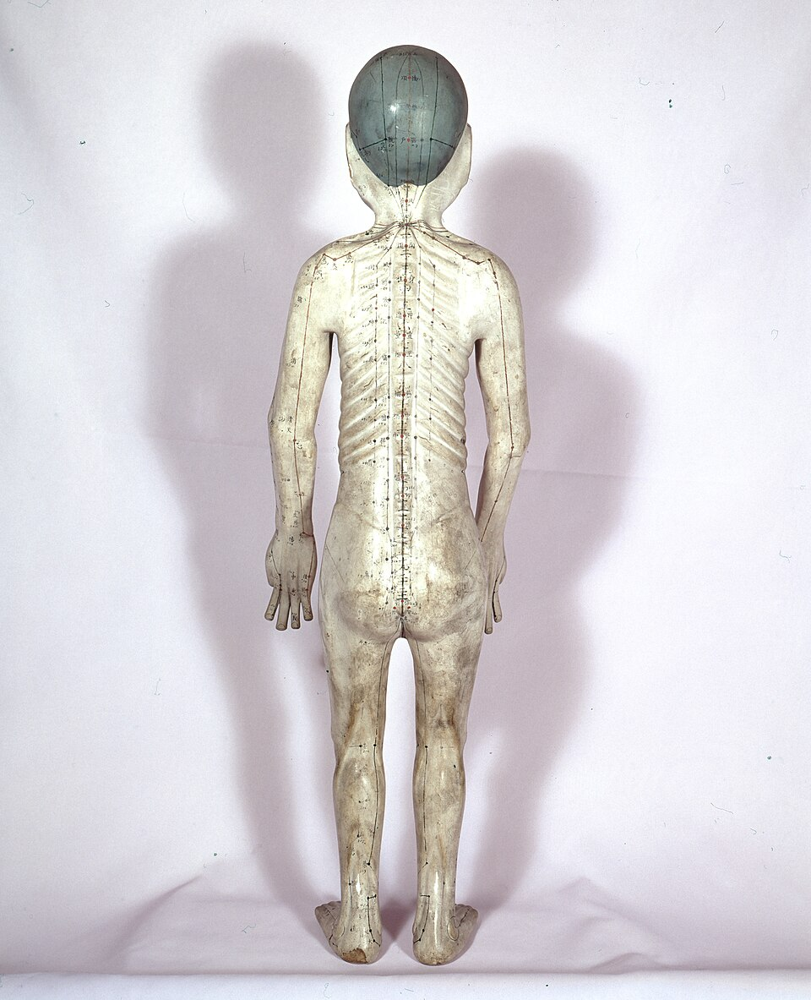

<!-- JPK_ENVELOPE_v1 -->

**JABATAN PEMBANGUNAN KEMAHIRAN (JPK)**
TINGKAT 7-8, BLOK D4, KOMPLEKS D,
PUSAT PENTADBIRAN KERAJAAN PERSEKUTUAN,
62530 PUTRAJAYA

## KERTAS PENERANGAN

| Medan | Nilai |
| --- | --- |
| KOD DAN NAMA PROGRAM | MP-031-3:2016 PERKHIDMATAN TUINALOGI |
| TAHAP | 3 |
| KOD DAN TAJUK UNIT KOMPETENSI | MP-031-3:2016-C01 TUINALOGY SERVICES CONSULTATION |
| NO. DAN PERNYATAAN AKTIVITI KERJA | 1. PREPARE TUINALOGY SERVICES CONSULTATION REQUIREMENT 2. CARRY OUT TUINALOGY SERVICES CONSULTATION 3. DETERMINE TUINALOGY SERVICES CONSULTATION 4. RECORD TUINALOGY SERVICES CONSULTATION ACTIVITIES |
| NO. KOD | MP-031-3:2016-C01/KP(1/4) |
| Muka Surat | 1/1 |
| WARNA KERTAS | PUTIH (White) |

**TAJUK:** 资料单 1：咨询区准备与客户接待

**TUJUAN:** 读完本资料单后，学员应能：

<!-- /JPK_ENVELOPE_v1 -->
# 资料单 1：咨询区准备与客户接待

## 学习成果

读完本资料单后，学员应能：
1. 描述良好咨询区域的六大特征
2. 解释客户接待礼仪与称谓使用
3. 列出书面与口头信息收集方法
4. 识别身份核实文件
5. 阐述按 MOH 要求建立与维护客户记录

---

*图 C01-1-1：青铜针灸人体模型，是咨询区常见的视觉参考工具，可在向客户解释经络走向与施术部位时使用，提升专业感与说服力。来源：Wikimedia Commons / CC BY-SA 4.0*

## 1. 良好咨询区域特征 (Consultation Area Features)

推拿咨询区域必须为客户提供舒适、安全且具私密性的环境。良好的咨询区域应满足以下六大特征：

| 特征 | 标准 | 备注 |
|------|------|------|
| 良好氛围 (Good ambiance) | 整洁、柔和音乐、淡雅装饰 | 营造放松气氛 |
| 舒适温度 (Comfortable temperature) | 22–25°C | 配置空调或风扇 |
| 低噪音水平 (Low noise level) | < 50 dB | 隔音处理 |
| 合适灯光 (Acceptable lighting) | 柔和暖色光，避免直射 | 可调式灯具 |
| 私密性 (Privacy) | 单独咨询室或屏风分隔 | 防偷窥、防偷听 |
| 安全特征 (Safety features) | 防滑地板、灭火器、急救箱、无障碍通道 | 符合 DOSH 与地方政府规定 |

### 1.1 法规依据
- **Laws of Malaysia Act 514** — Occupational Safety and Health Act 1994 (OSHA 1994)
- **地方议会** (Pihak Berkuasa Tempatan, PBT) 营业准证条例
- **DOSH** (Department of Occupational Safety and Health) 工作场所安全规定

## 2. 客户接待 (Client Reception)

### 2.1 接待礼仪
1. 客户进门即起立，微笑对视，主动问候："欢迎光临 / Selamat datang / Welcome"
2. 引导至咨询区，奉上温水或养生茶
3. 以适当称谓 (proper title) 称呼，如：
   - 先生 (Encik / Mr.)
   - 女士 (Puan / Mrs.)
   - 小姐 (Cik / Miss)
   - 拿督/拿汀 (Dato'/Datin)（如适用）
4. 使用客户母语或共通语言
5. 全程保持眼神接触与开放肢体语言

### 2.2 客户服务核心原则
- **尊重 (Respect)** — 不论种族、性别、年龄、宗教
- **专业 (Professionalism)** — 着装整洁、言语得体
- **保密 (Confidentiality)** — 不在公共区域讨论客户个案

## 3. 信息收集方法 (Information Collecting Methods)

| 类型 | 方法 | 适用情境 |
|------|------|----------|
| **书面 (Written)** | 信息表 (Information form) | 首次到访登记 |
| | 网络表单 (Online form) | 远程预约或筛查 |
| | 电信媒体讯息 (Telecommunication media messages) | WhatsApp、SMS 预约 |
| **口头 (Verbal)** | 面对面访谈 (Face-to-face interview) | 详细咨询 |
| | 电话访谈 (Phone calls) | 预约或追访 |

### 3.1 信息表必填项目
- 姓名 (Name)
- 出生日期 (Date of birth)
- 性别 (Gender)
- 联系电话 (Contact)
- 地址 (Address)
- 紧急联系人 (Emergency contact)
- 主诉 (Chief complaint)

## 4. 身份核实文件 (Identification Documents)

按马来西亚法令，客户身份须经以下任一文件核实：

| 文件 | 中文名称 | 说明 |
|------|---------|------|
| Identification Card (MyKad) | 身份证 | 大马公民必备 |
| Driver's Licence | 驾照 | 含照片可作核实 |
| Birth Certificate | 出生证明 | 未成年者使用 |
| Provincial/Territorial Health Insurance Card | 医疗保险卡 | 部分跨境客户 |
| Passport | 护照 | 外籍客户必备 |

> **重要：** 推拿师须将身份证号码与表单姓名核对一致；外籍客户须留存护照影印本。

## 5. 客户记录建立与保存 (Client Record Keeping)

### 5.1 记录类型 (Type)
- **手工 (Manual)** — 纸本档案夹，按字母或编号归档
- **电子 (Computerized)** — 电子病历系统 (EMR/EHR)，须定期备份

### 5.2 记录内容 (Contents)
1. **个人资料 (Personal data)** — 姓名、IC、联系方式、地址
2. **咨询信息 (Consultation)** — 主诉、健康史、四诊结果
3. **疗程信息 (Therapy)** — 推拿模式、手法、穴位、时长
4. **疗后信息 (Post therapy)** — 疗后反应、客户反馈、下次预约

### 5.3 三大原则
| 原则 | 中文 | 实施方式 |
|------|------|---------|
| Consents | 同意书 | 客户签署书面知情同意书 |
| Confidentiality | 保密 | 仅授权人员可查阅 |
| Security | 安全 | 上锁柜 / 加密系统 / 定期备份 |

### 5.4 法规要求
- **MOH (Ministry of Health)** — T&CM 法令 2013 规定记录至少保存 7 年
- **PDPA 2010** — 个人资料保护法令 (Personal Data Protection Act)
- 记录销毁须采用碎纸机或安全数据擦除

## 6. 安全与职业操守

- 接待区域配备急救箱、灭火器，员工须熟知位置与使用方法
- 所有员工须通过 PDPA 培训方可接触客户资料
- 严禁在社交媒体公开客户照片、记录或对话内容
- 敏感讨论（如疾病史）须在私密咨询室进行

## 7. 小结

良好的咨询区准备与客户接待是推拿服务的第一印象，直接影响客户信任度与依从性。从业者必须遵守 T&CM Act 2013、OSHA 1994 与 PDPA 2010 三大法令，确保环境、礼仪、信息收集与记录保存均达标。

## 参考文献
- T&CM Act 2013；OSHA 1994 (Act 514)；PDPA 2010
- MOH Code of Ethics for T&CM Practitioners, 2007
- 00-tuina-terminology.md