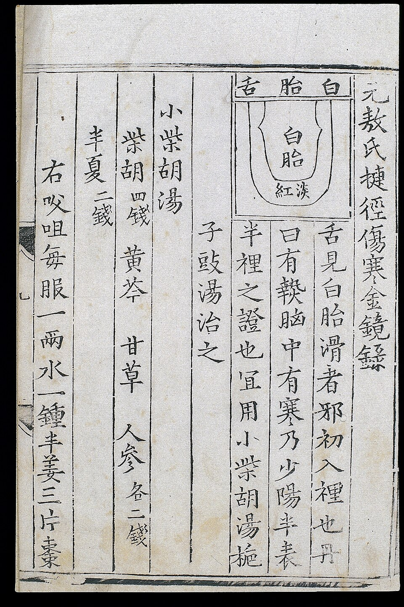
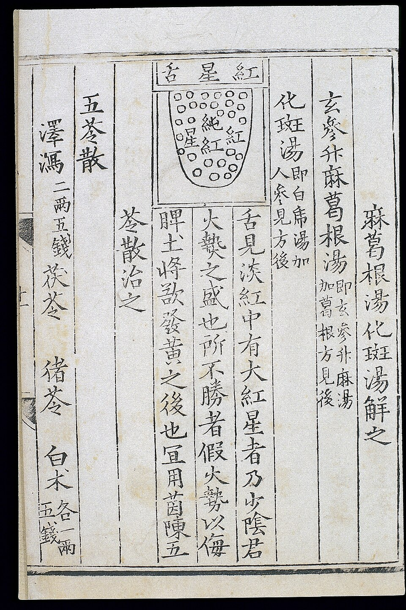
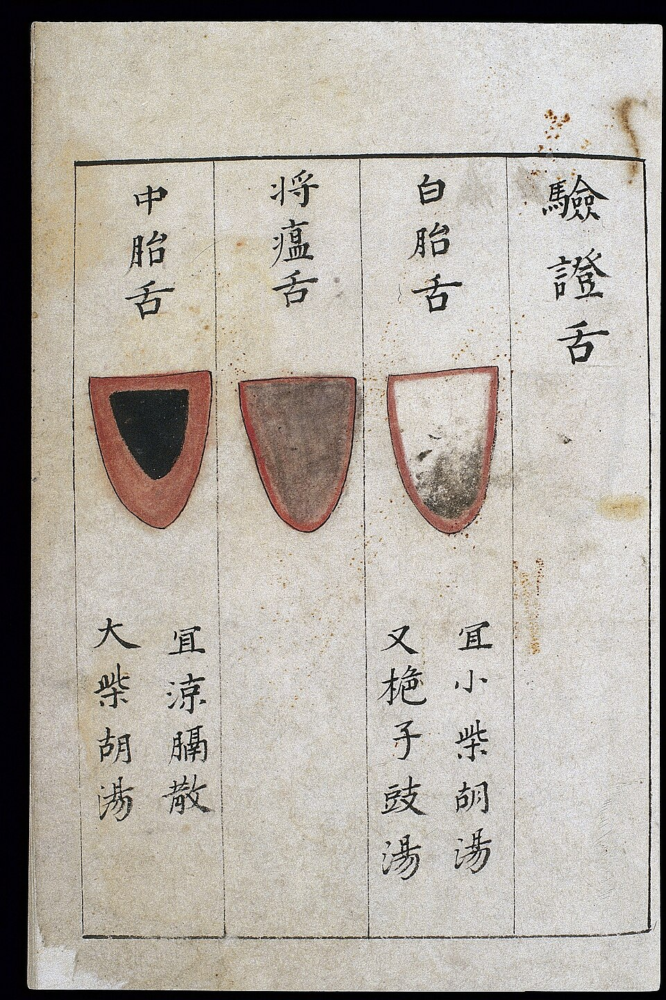
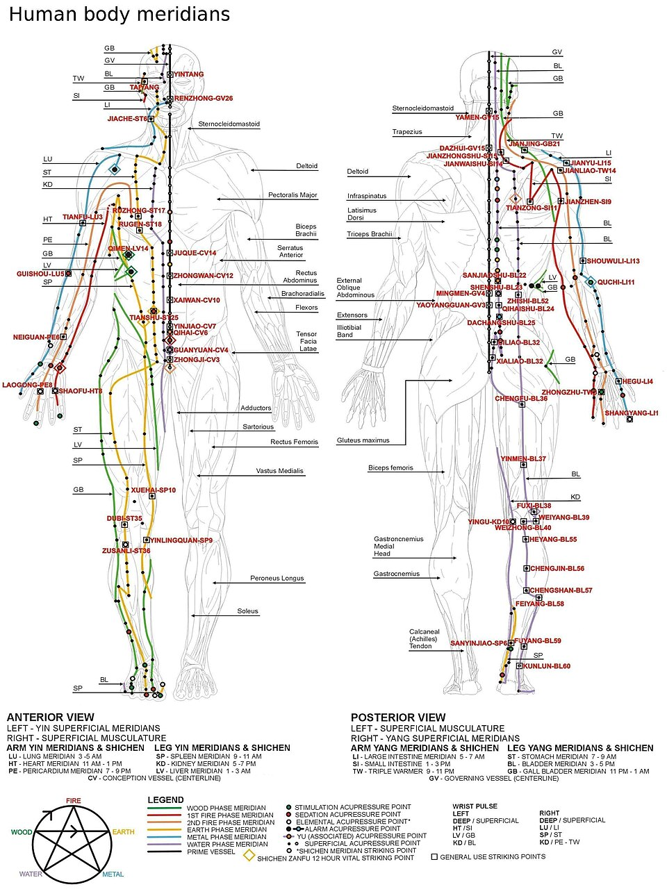

<!-- JPK_ENVELOPE_v1 -->

**JABATAN PEMBANGUNAN KEMAHIRAN (JPK)**
TINGKAT 7-8, BLOK D4, KOMPLEKS D,
PUSAT PENTADBIRAN KERAJAAN PERSEKUTUAN,
62530 PUTRAJAYA

## KERTAS PENERANGAN

| Medan | Nilai |
| --- | --- |
| KOD DAN NAMA PROGRAM | MP-031-3:2016 PERKHIDMATAN TUINALOGI |
| TAHAP | 3 |
| KOD DAN TAJUK UNIT KOMPETENSI | MP-031-3:2016-C01 TUINALOGY SERVICES CONSULTATION |
| NO. DAN PERNYATAAN AKTIVITI KERJA | 1. PREPARE TUINALOGY SERVICES CONSULTATION REQUIREMENT 2. CARRY OUT TUINALOGY SERVICES CONSULTATION 3. DETERMINE TUINALOGY SERVICES CONSULTATION 4. RECORD TUINALOGY SERVICES CONSULTATION ACTIVITIES |
| NO. KOD | MP-031-3:2016-C01/KP(2/4) |
| Muka Surat | 1/1 |
| WARNA KERTAS | PUTIH (White) |

**TAJUK:** 资料单 2：客户咨询与中医四诊评估

**TUJUAN:** 完成本资料单后，学员应能：

<!-- /JPK_ENVELOPE_v1 -->
# 资料单 2：客户咨询与中医四诊评估

## 学习成果

完成本资料单后，学员应能：
1. 区分预设病史采集表与笔记式收集方法
2. 解释客户对推拿治疗的常见期望
3. 收集完整的客户健康信息（现病史、既往史、家族史、用药史）
4. 描述中医肌骨解剖知识
5. 解释并演示中医四诊（望、闻、问、切）
6. 列出常用经络（穴位类别）部位
7. 取得客户知情同意并录入记录

---

## 1. 信息收集方法 (Information Gathering Method)

### 1.1 预设病史采集表 (Pre-set History Taking Form)
标准化表单，确保不遗漏关键项目。优点：

- 高效、统一格式
- 便于电子化与统计
- 满足 MOH 审计要求

### 1.2 笔记 (Notes)
开放式记录，捕捉客户原话与情境细节。

> **最佳实践：** 表单 + 笔记并用——表单确保完整性，笔记捕捉细微信息。

## 2. 客户对推拿的常见期望 (Common Client's Expectation)

| 期望 | 中文说明 |
|------|---------|
| Relief of Symptoms | 缓解症状（疼痛、酸痛、僵硬） |
| Therapeutic / Holistic Approach Treatment | 整体疗法（身、心、灵综合调理） |
| Improved Quality of Life | 改善生活质量（睡眠、活动、情绪） |
| Reduction of the Risk of Allopathic Treatments | 减少西医治疗依赖与副作用 |
| Self-Care Advice | 获取自我护理建议（饮食、起居、运动） |

## 3. 客户健康信息 (Client Wellness Information)

### 3.1 现病史 (Present)
- 肌肉/关节疼痛或酸痛部位 (Area of muscle or joint pain or ache)
- 生活方式 (Lifestyle)：作息、运动、饮食、压力源

### 3.2 既往史 (Past)
- 住院史 (Hospitalization)
- 既往治疗 (Therapy)：西医、中医、物理治疗

### 3.3 家族史 (Family History)
- 糖尿病 (Diabetes)
- 高血压、心血管疾病、癌症等遗传倾向

### 3.4 用药史 (Medication)
- **西药 (Allopathic)** — 抗凝血、降压、止痛药等
- **草药 (Herbal)** — 中药材、保健品、传统药膳

> **警示：** 服用抗凝血药物（如 Warfarin）的客户须特别注意推拿力度，避免皮下出血。

## 4. 中医肌骨解剖 (TCM Anatomy on Musculoskeletal)

| 部位 | 中文 | 推拿意义 |
|------|------|---------|
| Full Body | 全身 | 整体气血循环 |
| Joints | 关节 | 关节活动度恢复 |
| Soft Tissue | 软组织 | 肌肉、筋膜、肌腱放松 |
| Organs | 内脏 | 通过腹部推拿改善脏腑功能 |

### 4.1 主要肌肉群
- 颈肩部：斜方肌、肩胛提肌、胸锁乳突肌
- 腰背部：竖脊肌、菱形肌、背阔肌
- 四肢：肱二头肌、肱三头肌、股四头肌、腓肠肌

## 5. 中医四诊 (Four TCM Evaluation Method)

中医四诊为推拿评估的核心，包含**望、闻、问、切**四步。

### 5.1 望诊 (Wàng — Observation)
观察客户：
- 神 (Spirit)：精神状态、眼神
- 色 (Complexion)：面色（红、黄、白、青、黑）
- 形 (Form)：体型、姿势
- 态 (Posture)：步态、动作
- **舌诊 (Tongue Diagnosis)**：舌体、舌色、舌苔——四诊望诊的核心子项

*图 2-1：传统中医舌诊图谱——白苔舌示例。舌苔薄白主表寒/正常，厚白苔主寒湿、痰饮。来源：Wikimedia Commons / Wellcome Collection，CC BY 4.0*

*图 2-2：传统中医舌诊图谱——红星舌（舌面红点显著）多主热毒、心火上炎，与热证、烦躁失眠相关。来源：Wikimedia Commons / Wellcome Collection，CC BY 4.0*

### 5.2 闻诊 (Wén — Listening)
- 听声音：说话、咳嗽、呼吸
- 闻气味：口气、汗气

### 5.3 问诊 (Wèn — Questioning)
"十问歌"提示：寒热、汗、头身、二便、饮食、胸腹、耳目、睡眠、旧病、用药。

### 5.4 切诊 (Qiē — Palpation)
- 切脉：寸口脉（寸、关、尺）
- 触诊：按压肌肉、关节、穴位

> **推拿应用：** 切诊不仅用于诊断，也是手法施治前评估张力与压痛点的关键。

*图 2-3：14 世纪中医舌诊综合参考图——历代医家通过舌色（淡白、淡红、红、绛、紫）与舌苔（薄、厚、白、黄、灰、黑）组合诊断脏腑寒热虚实。是 NOSS C01 推拿前评估的标准依据之一。来源：Wikimedia Commons / Wellcome Collection，CC BY 4.0*

## 6. 常用经络（穴位类别）部位 (Common Acupressure Point Categories)

| 拼音 | 中文 | English |
|------|------|---------|
| Tóu bù | 头部 | Head |
| Shǒu / Shǒu zhī | 手 / 上肢 | Hand / Upper limb |
| Tuǐ / Xià zhī | 腿 / 下肢 | Leg / Lower limb |
| Bèi bù | 背部 | Back |
| Xiōng bù | 胸部 | Chest |

*图 2-4：十二正经全身循行总图——为 NOSS C01 经络评估的基础解剖图。咨询时根据症状部位回溯所属经络（如颈肩痛 → 手太阳/足少阳；下腰痛 → 足太阳）。来源：Wikimedia Commons，公有领域*

### 6.1 经络与脏腑关系（简表）
- 手三阴经：肺、心包、心
- 手三阳经：大肠、三焦、小肠
- 足三阴经：脾、肝、肾
- 足三阳经：胃、胆、膀胱

## 7. 肌肉骨骼、平衡与舒适评估 (Musculoskeletal, Balance and Comfort)

| 评估项 | 方法 |
|--------|------|
| 关节活动度 (ROM) | 主动 / 被动测试 |
| 肌力 | MRC 0–5 级 |
| 平衡 | 单足站立测试、Romberg 试验 |
| 舒适度 | VAS 疼痛量表 0–10 分 |
| 姿势 | 站姿、坐姿对称性 |

## 8. 知情同意 (Informed Consent) 与记录录入

### 8.1 知情同意要素
1. 推拿目的与预期效果
2. 推拿方法与可能感受（酸、胀、麻）
3. 可能风险与副作用
4. 替代方案
5. 客户随时撤回权利
6. 客户签字 + 日期

### 8.2 录入客户记录
- 立即（疗程后 24 小时内）录入
- 用客观语言（避免主观判断）
- 使用标准缩写（IC、ROM、VAS）
- 修改时划线 + 签名 + 日期，不得涂改

## 9. 安全与职业操守

- 异性客户咨询须有第三方在场或录像
- 涉及未成年（< 18 岁）须监护人同意
- 怀疑虐待、家暴或重大疾病须依法上报

## 10. 小结

推拿咨询是建立医患信任的关键环节。从业者须运用预设表单与笔记结合，全面收集客户期望、健康信息与四诊数据，并以专业态度取得知情同意，方可制定有效安全的推拿方案。

## 参考文献
- Yen Si Tao et al, China National Tuina Standard Textbook 13th Ed, 2003
- Richardson J (2004), What Patients Expect From Complementary Therapy
- 00-tuina-terminology.md（四诊与经络章节）