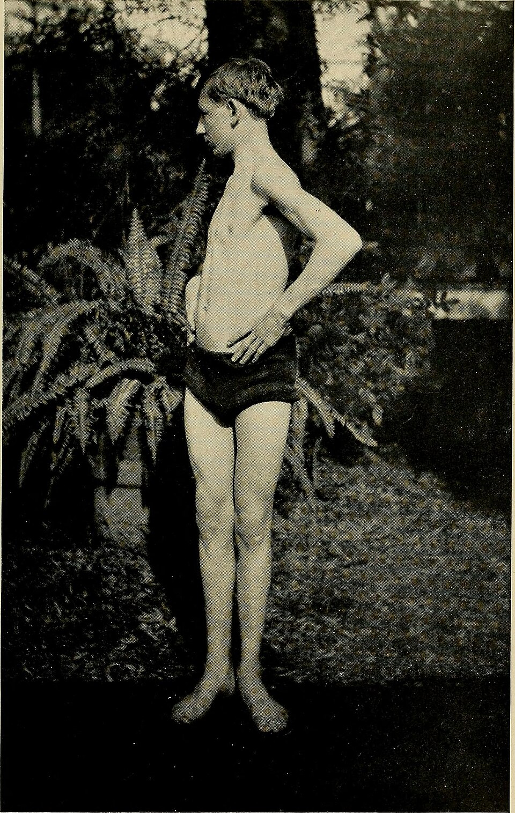

<!-- JPK_ENVELOPE_v1 -->


**JABATAN PEMBANGUNAN KEMAHIRAN (JPK)**
TINGKAT 7-8, BLOK D4, KOMPLEKS D,
PUSAT PENTADBIRAN KERAJAAN PERSEKUTUAN,
62530 PUTRAJAYA

## KERTAS PENERANGAN

| Medan | Nilai |
| --- | --- |
| KOD DAN NAMA PROGRAM | MP-031-3:2016 PERKHIDMATAN TUINALOGI |
| TAHAP | 3 |
| KOD DAN TAJUK UNIT KOMPETENSI | MP-031-3:2016-C01 TUINALOGY SERVICES CONSULTATION |
| NO. DAN PERNYATAAN AKTIVITI KERJA | 1. PREPARE TUINALOGY SERVICES CONSULTATION REQUIREMENT<br>2. CARRY OUT TUINALOGY SERVICES CONSULTATION<br>3. DETERMINE TUINALOGY SERVICES CONSULTATION<br>4. RECORD TUINALOGY SERVICES CONSULTATION ACTIVITIES |
| NO. KOD | MP-031-3:2016-C01/KP(4/4) |
| Muka Surat | 1/1 |
| WARNA KERTAS | PUTIH (White) |

**TAJUK:** 资料单 4：推拿服务方案制定

**TUJUAN:** 完成本资料单后，学员应能：

<!-- /JPK_ENVELOPE_v1 -->
# 资料单 4：推拿服务方案制定


## 学习成果

完成本资料单后，学员应能：
1. 介绍五大推拿模式 (Modalities of Tuina) 及其适用对象
2. 阐述推拿益处与可能效应
3. 解释 MOH T&CM 转介伦理
4. 实施客户记录保密与安全维护
5. 实施客户书面知情同意

---


*图 C01-4-1：传统手法治疗示意，是制定推拿服务方案时向客户展示不同模式的视觉参考。来源：Wikimedia Commons / Public Domain*

## 1. 推拿模式 (Modalities of Tuina)

NOSS MP-031-3:2016 涵盖以下五大推拿模式：

### 1.1 全身推拿 (Full Body Tuina)
- **目标：** 改善整体气血循环，全身放松
- **时长：** 60–90 分钟
- **对象：** 一般亚健康、压力大者
- **重点部位：** 头、颈、肩、背、四肢、足底

### 1.2 运动推拿 (Sport Tuina)
- **目标：** 运动前预热、运动后恢复、运动伤害康复
- **时长：** 30–60 分钟
- **对象：** 运动员、健身爱好者
- **重点：** 大腿、小腿、肩袖、踝关节

### 1.3 肌骨推拿 (Musculo-skeletal Tuina)
- **目标：** 处理特定肌骨疾患（颈椎病、肩周炎、腰椎间盘突出等）
- **时长：** 30–60 分钟
- **对象：** 慢性疼痛、姿势不良者
- **手法：** 滚法、按揉、弹拨、扳法

### 1.4 小儿推拿 (Paediatric Tuina)
- **目标：** 调理小儿常见症（厌食、积滞、便秘、夜啼、感冒）
- **时长：** 10–20 分钟
- **对象：** 6 个月至 12 岁小儿
- **特点：** 力轻、节奏快、配合小儿专用穴

### 1.5 女子推拿 (Woman Tuina)
- **目标：** 调理月经、孕前/产后、更年期不适
- **时长：** 45–60 分钟
- **对象：** 适龄女性（避开月经期与孕中后期禁忌）
- **重点：** 腰骶（避孕期）、肩颈、足部

### 1.6 模式选择决策表

| 客户主诉 | 优选模式 |
|---------|---------|
| 全身疲劳、压力大 | 全身推拿 |
| 运动后肌肉酸痛 | 运动推拿 |
| 肩颈僵硬、腰痛 | 肌骨推拿 |
| 小儿食欲不振 | 小儿推拿 |
| 月经不调（非经期） | 女子推拿 |

## 2. 推拿益处 (Benefits of Tuina)

按 NOSS 列明的三大主要益处：

| 益处 | 中文说明 | 现代医学解释 |
|------|---------|-------------|
| Breaks down scar tissue to relax muscles and tendons | 分解疤痕组织以放松肌肉与肌腱 | 软化粘连、改善筋膜 |
| Creates the road for Qi to circulate in a proper way | 创造气循环的正常通路 | 改善微循环、激活经络 |
| Speed up body natural wellness recovery | 加速身体自然康复 | 提升副交感神经活动、增强免疫 |

### 2.1 可能效应 (Possible Effects)
**正向效应：**
- 疼痛减轻、活动度提升
- 睡眠改善
- 情绪舒缓
- 肠胃功能改善

**短暂不良反应（需告知客户）：**
- 推拿后酸胀（24–48 小时内消退）
- 皮下青紫（手法过重时）
- 头晕（首次推拿后常见）
- 排便排尿增加（排毒反应）

## 3. 转介政策与 T&CM 伦理

### 3.1 MOH T&CM 从业者道德守则核心
依据 **Code of Ethics for T&CM Practitioners (MOH 2007)**：

1. **客户福祉至上** — 不可为业绩损害客户健康
2. **诚信** — 不夸大疗效、不诋毁其他医疗
3. **保密** — 严守客户隐私
4. **持续学习** — 定期进修、更新知识
5. **同行尊重** — 不诋毁其他从业者
6. **如实转介** — 超出能力范围必转介

### 3.2 转介流程（详见 KP-03）
推拿师须熟知本社区可转介的西医、中医、物理治疗及其他 T&CM 机构，建立合作网络。

## 4. 客户记录保密与安全维护

### 4.1 保密 (Confidentiality)
- 仅治疗团队与必要人员可查阅
- 任何对外披露须客户书面同意
- 对话不在公共区域进行
- 不在社交媒体公开任何客户信息

### 4.2 安全 (Security)
| 类型 | 措施 |
|------|------|
| 纸本记录 | 上锁档案柜，钥匙限授权人员 |
| 电子记录 | 加密硬盘、强密码、定期备份、双重认证 |
| 销毁 | 碎纸机或专业数据擦除 |
| 转移 | 加密传输（加密 PDF + 密码分发） |

### 4.3 法规依据
- **Personal Data Protection Act 2010 (PDPA)**
- **T&CM Act 2013**
- 按 PDPA 7 大原则：一般、通知与选择、披露、安全、保留、数据完整、访问

## 5. 客户书面知情同意 (Written Informed Consent)

### 5.1 同意书内容
完整的推拿服务知情同意书应包含：

1. **客户基本资料** — 姓名、IC、联系方式
2. **推拿目的与方法** — 计划的模式与重点部位
3. **预期效果** — 可能的改善与时长
4. **风险告知** — 短暂酸胀、青紫、罕见严重反应
5. **替代方案** — 其他治疗选择
6. **保密条款** — 个人资料处理方式
7. **撤回权** — 客户可随时终止
8. **同意声明** — "本人已阅读并理解上述内容..."
9. **签字 + 日期** — 客户与推拿师双方签署
10. **见证人**（如适用）— 未成年或语言障碍时

### 5.2 同意书取得流程
```
推拿师准备同意书
        ↓
口头解释每项内容
        ↓
回答客户疑问
        ↓
客户阅读全文
        ↓
客户签字 + 日期
        ↓
推拿师签字
        ↓
副本交客户，原件入档
```

### 5.3 特殊情况
- **未成年 (< 18 岁)：** 监护人同意 + 共同签署
- **语言障碍：** 提供翻译版本或翻译员见证
- **认知障碍：** 由法定代理人签署
- **紧急情况：** 不适用（直接转介）

## 6. 推拿服务方案撰写要素

完整方案应包括：

| 要素 | 内容 |
|------|------|
| 客户基本资料 | 姓名、年龄、IC、联系方式 |
| 主诉与评估摘要 | 现病史 + 四诊结果 |
| 适应症确认 | 列明本次推拿对应症状 |
| 禁忌排除 | 确认无禁忌症 |
| 推拿模式选择 | 全身/运动/肌骨/小儿/女子 |
| 重点部位与手法 | 经络、穴位、八大手法 |
| 时长与频率 | 每次时长、疗程总次数、间隔 |
| 注意事项 | 推拿前后须知 |
| 自我护理建议 | 饮食、作息、运动 |
| 复诊安排 | 下次预约日期 |
| 评估指标 | VAS、ROM 等 |

## 7. 安全与职业操守

- **不可承诺治愈** — 推拿是辅助调理，非疾病治疗
- **明示费用** — 方案附带明确报价
- **保留方案副本** — 客户与中心各持一份
- **方案变更须重新同意** — 新增模式或部位须客户确认

## 8. 小结

推拿服务方案的制定需综合客户需求、四诊评估、模式选择与法规要求，并通过书面知情同意保障双方权益。整个过程体现 T&CM 从业者的专业、伦理与法律意识。

## 参考文献
- MOH (2007), Code of Ethics for T&CM Practitioners
- T&CM Act 2013
- PDPA 2010
- Yen Si Tao et al, China National Tuina Standard Textbook 13th Ed, 2003
- 00-tuina-terminology.md