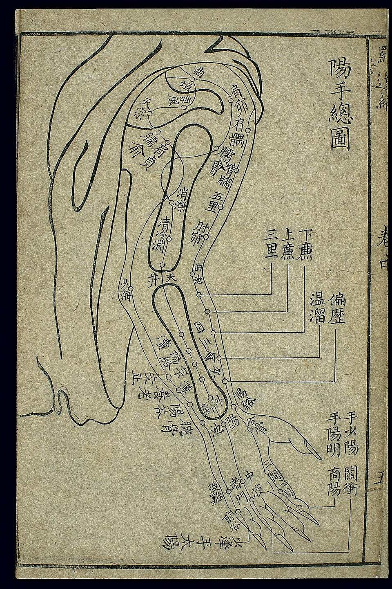

<!-- JPK_ENVELOPE_v1 -->

**JABATAN PEMBANGUNAN KEMAHIRAN (JPK)**
TINGKAT 7-8, BLOK D4, KOMPLEKS D,
PUSAT PENTADBIRAN KERAJAAN PERSEKUTUAN,
62530 PUTRAJAYA

## KERTAS PENERANGAN

| Medan | Nilai |
| --- | --- |
| KOD DAN NAMA PROGRAM | MP-031-3:2016 PERKHIDMATAN TUINALOGI |
| TAHAP | 3 |
| KOD DAN TAJUK UNIT KOMPETENSI | MP-031-3:2016-C02 TUINALOGY SERVICES PREPARATION |
| NO. DAN PERNYATAAN AKTIVITI KERJA | 1. PREPARE TUINALOGY SERVICES EQUIPMENT AND TOOLS 2. PREPARE TUINALOGY SERVICES AREA 3. PREPARE CUSTOMER FOR TUINALOGY SERVICES 4. RECORD TUINALOGY SERVICES PREPARATION ACTIVITIES |
| NO. KOD | MP-031-3:2016-C02/KP(1/3) |
| Muka Surat | 1/1 |
| WARNA KERTAS | PUTIH (White) |

**TAJUK:** 资料单 1：全身推拿服务准备

**TUJUAN:** 读完本资料单后，学员应能：

<!-- /JPK_ENVELOPE_v1 -->
# 资料单 1：全身推拿服务准备

## 学习成果

读完本资料单后，学员应能：
1. 评估客户偏好与服务期望
2. 安排合适的服务时长结构
3. 识别客户在推拿过程中可能出现的反应
4. 复述全身推拿涉及的 TCM 肌骨解剖
5. 复核中医四诊于术前的应用
6. 标定常用经络与 80 个常用穴位部位
7. 选择合适的客户体位
8. 准备符合卫生与安全标准的推拿用品

---

> ⚠️ **Pregnancy Contraindication** — LI-4 (合谷/Hegu), SP-6 (三阴交/Sanyinjiao), GB-21 (肩井/Jianjing) mentioned in this document are forbidden during pregnancy at all trimesters per T&CM Act 2013 Section 28. Do NOT apply to pregnant clients. See `_reference/pregnancy-safety-reference.md`.

*图 C02-1-1：手三阳经（手阳明大肠经、手少阳三焦经、手太阳小肠经）走向示意，是全身推拿术前定位与穴位标定的基础参考。来源：Wikimedia Commons / Public Domain*

## 1. 客户偏好评估 (Client Preference Assessment)

每位客户对全身推拿的需求与承受度均不同。术前必须再次确认偏好以个性化服务。

| 评估项 | 内容 | 应对建议 |
|--------|------|---------|
| 客户期望 (Expectation) | 放松 / 缓痛 / 改善睡眠 / 调理体质 | 调整手法主调（轻柔 vs 较深） |
| 过敏史 (Allergy) | 推拿油、爽身粉、植物精油 | 改用无香基础油或免介质操作 |
| 压力承受 (Pressure tolerance) | 喜轻 / 中 / 重力度 | 力度从 30% 起评估 |
| 偏好部位 (Focus area) | 颈肩 / 腰背 / 下肢 / 足部 | 在标准顺序中加重该部位时间 |
| 避开部位 (Avoid area) | 旧伤、瘢痕、敏感点、宗教考量 | 完全避开或采用 V 形跳过 |
| 性别偏好 (Gender preference) | 异性推拿师接受度 | 安排同性推拿师并记录 |

> **重要：** 任何信息变化（如新过敏、新伤、孕期）须立即更新客户记录。

## 2. 服务时长安排 (Service Duration Structure)

| 时长 | 适用情境 | 时间分配（建议） |
|------|---------|-----------------|
| 30 分钟 | 局部紧急疏解、初次试做 | 单部位深耕 |
| 45 分钟 | 半身（上半 / 下半） | 俯卧 + 仰卧短程 |
| **60 分钟（标准）** | 一般保健全身 | 俯卧 25 + 侧卧 10 + 仰卧 25 |
| 90 分钟 | 深度调理 + 头面 | 俯卧 35 + 侧卧 15 + 仰卧 30 + 头面 10 |
| 120 分钟 | 慢性调理 / 双人疗程 | 俯卧 40 + 侧卧 20 + 仰卧 40 + 头面足底 20 |

> 时长应于咨询时确认，并体现于客户同意书。中途停止须征得客户同意并记录。

## 3. 客户可能反应 (Possible Client Responses)

### 3.1 正常反应（Expected）
- 放松、嗜睡甚至入睡
- 局部温热感、轻微酸胀
- 咕咕肠鸣、打嗝（气血流动）
- 情绪释放（少量眼泪）
- 服务后短暂疲倦或轻盈感

### 3.2 不良反应（Adverse — 须留意）
- 持续剧烈疼痛（VAS ≥ 7）
- 头晕、恶心、面色苍白、冷汗
- 心悸、呼吸急促
- 局部出现明显瘀斑（特别是凝血障碍者）
- 皮肤红疹（介质过敏）
- 服务后超过 48 小时仍持续酸痛

### 3.3 危急反应（Emergency — 须立即停止并求医）
- 晕厥
- 急性胸痛 / 呼吸困难
- 抽搐
- 严重过敏反应（呼吸困难、面部肿胀）

> **处置流程：** 停手 → 让客户平卧 → 测量生命体征 → 必要时拨 999 / 送医 → 记录事件。

## 4. 中医肌骨解剖 (TCM Musculoskeletal Anatomy)

### 4.1 全身分区

| 部位 | 主要肌群 / 结构 | 推拿要点 |
|------|----------------|---------|
| 头面 (Tóu miàn) | 颞肌、咬肌、额肌；眼轮匝肌 | 力度宜轻 |
| 颈项 (Jǐng xiàng) | 胸锁乳突肌、斜方肌上部 | 避开颈动脉 |
| 肩部 (Jiān) | 三角肌、冈上肌、肩胛提肌 | 重点松解粘连 |
| 上肢 (Shǒu) | 肱二/三头、前臂屈伸肌群 | 关节配合活动 |
| 背部 (Bèi) | 斜方肌、菱形肌、竖脊肌、背阔肌 | 沿膀胱经施手法 |
| 腰骶 (Yāo) | 腰方肌、竖脊肌下段、骶棘肌 | 力度循序、孕妇避开 |
| 胸腹 (Xiōng/Fù) | 胸大肌、腹直肌、腹斜肌 | 顺时针摩腹 |
| 臀 (Tún) | 臀大/中/小、梨状肌 | 坐骨神经分布注意 |
| 下肢 (Tuǐ) | 股四头、腘绳肌、腓肠肌 | 配合关节活动 |
| 足部 (Zú) | 足底筋膜、趾屈肌 | 涌泉穴重点 |

### 4.2 内脏对应区（背部俞穴投影）
- 心俞（T5）、肝俞（T9）、脾俞（T11）、肾俞（L2） — 对应五脏。

## 5. 中医四诊术前复核

| 诊法 | 术前复核要点 |
|------|------------|
| 望 | 面色、神色、姿势、皮肤状态、有否新损伤 |
| 闻 | 呼吸是否平稳、声音是否疲弱 |
| 问 | 自上次服务后有何变化？睡眠、饮食、二便？ |
| 切 | 简短脉诊；触诊重点部位张力与压痛 |

> 若发现新红旗征（red flags：发热、剧痛、神经症状），应暂停推拿并转介医师。

## 6. 常用经络与穴位 (Meridians & Acupoints)

按 NOSS 列示，C02 重点为五大部位经络：

| 部位 | 拼音 | 主要经络 | 常用穴位（举例） |
|------|------|---------|-----------------|
| 头部 | Tóu bù | 督脉、足太阳膀胱经 | 百会、风池、太阳、印堂 |
| 上肢 | Shǒu | 手三阴 / 手三阳 | 肩井、曲池、合谷、内关、外关 |
| 下肢 | Tuǐ | 足三阴 / 足三阳 | 足三里、阳陵泉、三阴交、涌泉 |
| 背部 | Bèi bù | 督脉、足太阳膀胱经 | 大椎、肺俞、肝俞、肾俞、命门 |
| 胸部 | Xiōng bù | 任脉、足阳明胃经 | 膻中、中脘、天枢、气海、关元 |

> 学员需熟记至少 80 个常用穴位之解剖部位与一般功效，以辅助配穴。

## 7. 客户体位 (Client Positioning)

| 体位 | 适用 | 注意 |
|------|------|------|
| 俯卧 (Prone) | 背、腰、臀、下肢后侧 | 胸下与脚踝下垫枕 |
| 仰卧 (Supine) | 头面、胸腹、上肢、下肢前侧 | 膝下垫枕减腰压 |
| 侧卧 (Side-lying) | 孕妇、肥胖者、胸部或腹部不适者 | 双膝间夹枕 |
| 坐位 (Seated) | 头颈肩快速疏解；行动不便者 | 前胸有靠垫 |

> 转换体位须协助客户缓慢起身，避免体位性低血压。

## 8. 推拿用品 (Tuina Materials)

| 用品 | 规格 | 卫生要求 |
|------|------|---------|
| 推拿油 | 食品级 / 医用级；一次性按摩杯分装 | 客户专用、用毕封盖 |
| 爽身粉 | 无滑石粉者优先 | 撒于干燥部位 |
| 大铺巾 | 整张覆盖推拿床 | 一客一换 |
| 小毛巾 | 4–6 条 | 一客一换 |
| 靠枕 | 不同尺寸 | 套布一客一换 |
| 床头垫圈 (Face cradle) | 俯卧用 | 套布一客一换 |
| 计时器 | 静音 | — |

## 9. 安全与职业操守

- 异性推拿须有第三方在场或装设观察窗
- 客户隐私部位以毛巾遮蔽（draping）
- 推拿师着装整洁、修剪指甲、洗手消毒
- 自身保持正确姿势（Body Mechanics）：站立时腰背直、用身体重量而非肩臂力
- 介质开封后须标注开封日期，超过保质期立即丢弃

## 10. 小结

完整的术前准备是高质量全身推拿的基础。从客户偏好评估、时长安排、四诊复核、解剖与经络掌握到用品准备，每环节均影响疗效与安全。从业者必须建立标准化术前 checklist，确保零遗漏。

## 参考文献
- China National Tuina Standard Textbook 13th Ed., 2003
- WHO (2010) Benchmarks for Training in Tuina
- T&CM Act 2013、PDPA 2010
- MOH Code of Ethics for T&CM Practitioners, 2007
- 00-tuina-terminology.md