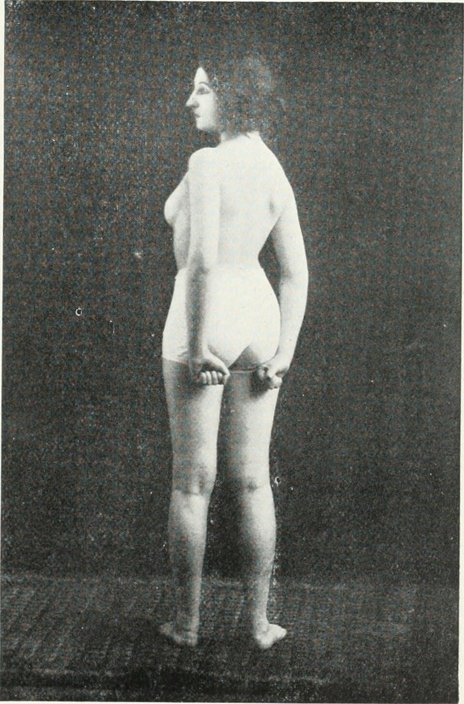

# 资料单 2：全身推拿八大手法详解

**WIM 编码：** MP-031-3:2016-C02/KP(2/3)(PUTIH)
**NOSS：** MP-031-3:2016 推拿疗法服务 (Level 3)
**CU：** C02 全身推拿服务
**对应工作活动：** WA2 — 执行全身推拿服务
**纸张颜色：** 白
**时数：** 84 小时（理论 RK — 核心模块）
**最后更新：** 2026-04-17
---

## 学习成果

读完本资料单后，学员应能：
1. 掌握推、拿、按、捏、揉、捻、摩、拍八大手法之原理与动作要领
2. 描述每一手法的力度、速度、节奏与深度调控
3. 识别每一手法适用部位与禁忌
4. 阐述全身推拿标准顺序（俯卧 → 侧卧 → 仰卧）
5. 解释经络循行与配穴原则
6. 持续观察并响应客户反应
7. 识别并处置紧急情况

---

> ⚠️ **Pregnancy Contraindication** — LI-4 (合谷/Hegu), GB-21 (肩井/Jianjing) mentioned in this document are forbidden during pregnancy at all trimesters per T&CM Act 2013 Section 28. Do NOT apply to pregnant clients. See `_reference/pregnancy-safety-reference.md`.

## 0. 八大手法概论 (Overview of Eight Major Manipulations)

中医推拿源于《黄帝内经》，发展至今形成系统的"手法"体系。NOSS C02 重点训练的八大手法为：

| 序 | 中文 | 拼音 | 英文 | 主要部位 |
|---:|------|------|------|---------|
| 1 | 推 | Tuī | Pushing | 背、四肢、头面 |
| 2 | 拿 | Ná | Grasping | 颈肩、四肢肌腹 |
| 3 | 按 | Àn | Pressing | 穴位、肌肉结节 |
| 4 | 捏 | Niē | Pinching | 脊柱（捏脊）、四肢 |
| 5 | 揉 | Róu | Kneading | 全身适用 |
| 6 | 捻 | Niǎn | Twisting | 指趾、耳廓 |
| 7 | 摩 | Mó | Rubbing | 腹部、胸部、面部 |
| 8 | 拍 | Pāi | Tapping | 背、腰、四肢 |

> **共同要求 (六字诀)：** 持久、有力、均匀、柔和、深透、节律。

*图 2-1：人体十二正经循行总图——八大手法所有操作均沿经络走向施术，是 NOSS C02 全身推拿的核心解剖基础。来源：Wikimedia Commons，公有领域 (Public Domain)*

---

## 1. 推法 (Tuī, Pushing)

### 1.1 定义
单手或双手以指、掌、肘等部位贴附体表，按一定方向直线推动，称推法。

### 1.2 动作要领
- **着力部位：** 拇指、四指、掌根、全掌、肘尖
- **方向：** 直线、单向（不可来回拉锯）
- **着力点稳固，全身用力，意贯指端**
- 推动时贴附皮肤而不浮动，速度均匀

### 1.3 力度 / 速度 / 节奏 / 深度
| 参数 | 范围 |
|------|------|
| 力度 | 轻 (5N) → 中 (15N) → 重 (30N) |
| 速度 | 60–120 次 / 分钟 |
| 节奏 | 均匀连续 |
| 深度 | 表皮（轻推）→ 肌层（中推）→ 骨膜（重推） |

### 1.4 适应部位
- 背部足太阳膀胱经（沿脊柱两侧）
- 上肢手三阴经
- 下肢足三阳经
- 头面（开天门、推坎宫）

*图 2-2：背部推法主要沿足太阳膀胱经施术（脊柱旁开 1.5 寸与 3 寸两条侧线）；推法是疏通背俞穴、调节脏腑功能的最关键手法。来源：Wikimedia Commons / Wellcome Collection，CC BY 4.0*

### 1.5 临床功效
疏通经络、行气活血、解表散寒、缓解肌肉紧张。

### 1.6 注意 / 禁忌
- 推方向应顺着肌纤维或经络循行
- 体质虚弱者用轻推
- 急性损伤期不可重推

---

## 2. 拿法 (Ná, Grasping)

### 2.1 定义
拇指与其余四指（或仅食中指）相对捏住肌肉或肌腱，做有节奏的提捏与放松动作。

### 2.2 动作要领
- **着力部位：** 指腹（不可指甲掐）
- **动作：** 提起 → 捏紧 → 放松，反复进行
- 腕关节放松，前臂带动手指
- 拿起的肌肉要"提得起、捏得透"

### 2.3 参数
| 参数 | 范围 |
|------|------|
| 力度 | 中至重（须客户能忍受） |
| 速度 | 30–60 次 / 分钟 |
| 节奏 | 一提一放 |
| 深度 | 浅层皮下 → 深层肌肉 |

### 2.4 适应部位
- 颈项（拿肩井）
- 上肢肌腹（肱二头、前臂屈肌）
- 下肢（股四头、腓肠肌）

### 2.5 临床功效
祛风散寒、舒筋活络、解痉止痛。常用于落枕、肩颈僵硬、肌肉劳损。

### 2.6 注意 / 禁忌
- 不可用指甲，避免抓痕与瘀伤
- 凝血障碍、皮肤破溃禁用
- 颈部拿法力度不可过重，避免压迫颈动脉

---

## 3. 按法 (Àn, Pressing)

### 3.1 定义
以拇指、掌根或肘尖在穴位或局部施加垂直压力，称按法。

### 3.2 动作要领
- **着力部位：** 拇指（穴位）、掌根（大面积）、肘尖（深层结节）
- 动作"由轻到重，稳而持久"
- 按压时屏息凝神，得气后保持 3–10 秒
- 缓慢卸力，避免瞬间释放

### 3.3 参数
| 参数 | 范围 |
|------|------|
| 力度 | 中至极重（肘按） |
| 速度 | 静止持续型，每穴 3–10 秒 |
| 节奏 | 按 → 停 → 缓放 |
| 深度 | 直达肌层、骨膜 |

### 3.4 适应部位 / 常配穴位
- 风池、肩井、天宗、肝俞、肾俞、环跳、足三里、涌泉

### 3.5 临床功效
开通闭塞、放松痉挛、镇静止痛。可激发"得气感"（酸、麻、胀、重）。

### 3.6 注意 / 禁忌
- 避开大血管、神经干（如颈动脉、桡神经沟）
- 老年人骨质疏松者慎用肘按
- 孕妇腹部、腰骶部禁按

---

## 4. 捏法 (Niē, Pinching)

### 4.1 定义
拇指与食指（或拇食中三指）相对捏起皮肤与浅层肌肉，边捏边推进，称捏法。

### 4.2 动作要领
- 双拇指在前下推，食中指在后捏起皮肤
- 沿脊柱由下而上"捏脊"是经典应用
- 捏起 → 推进 → 放下 → 再捏

### 4.3 参数
| 参数 | 范围 |
|------|------|
| 力度 | 轻至中 |
| 速度 | 缓慢均匀 |
| 节奏 | 一捏一进 |
| 深度 | 皮肤与浅筋膜 |

### 4.4 适应部位
- 督脉（捏脊三遍 / 五遍 / 七遍）
- 上下肢肌腹

### 4.5 临床功效
调和阴阳、健脾和胃、强壮体质（特别小儿与体质虚弱者）。

### 4.6 注意 / 禁忌
- 皮肤破溃、湿疹禁用
- 老年皮肤松弛者力度宜轻

---

## 5. 揉法 (Róu, Kneading)

### 5.1 定义
以指、掌或鱼际在体表做圆周轨迹的揉动，皮肤随手指共同移动，不在皮表摩擦。

### 5.2 动作要领
- **着力部位：** 指腹、掌根、大鱼际、小鱼际
- 圆周动作，方向顺时针或逆时针均可
- 皮下组织随揉而动，皮肤不滑动
- 腕关节放松，前臂主导

### 5.3 参数
| 参数 | 范围 |
|------|------|
| 力度 | 轻至中 |
| 速度 | 60–160 次 / 分钟 |
| 节奏 | 持续均匀圆周 |
| 深度 | 皮下至浅肌层 |

### 5.4 适应部位
- 全身皆可
- 头面、腹部、胸部、肌肉结节

### 5.5 临床功效
活血化瘀、消肿止痛、放松紧张。揉法是最"温和"的手法，常作为开局与收尾。

### 5.6 注意
- 力度循序渐进
- 腹部揉应顺时针方向（与肠蠕动方向一致）

---

## 6. 捻法 (Niǎn, Twisting)

### 6.1 定义
拇指与食指相对夹住手指、脚趾或耳廓，做对指搓捻。

### 6.2 动作要领
- 指夹紧但不掐
- 前后搓捻如搓绳
- 双向均匀

### 6.3 参数
| 参数 | 范围 |
|------|------|
| 力度 | 轻至中 |
| 速度 | 100–200 次 / 分钟 |
| 节奏 | 快速连续 |
| 深度 | 表皮 |

### 6.4 适应部位
- 手指、脚趾末节
- 耳廓（耳穴疗法配合）

### 6.5 临床功效
通利关节、改善末梢循环、配合耳穴调脏腑。

### 6.6 注意
- 指甲外伤、甲沟炎禁用

---

## 7. 摩法 (Mó, Rubbing)

### 7.1 定义
掌或四指指腹环转抚摩体表，皮肤与施术部位之间有摩擦，是最轻柔的手法。

### 7.2 动作要领
- **着力部位：** 全掌、四指
- 环形或单向移动
- 力度极轻，"如抚如摩"
- 与揉法不同：摩法皮肤滑动，揉法皮肤不动

### 7.3 参数
| 参数 | 范围 |
|------|------|
| 力度 | 极轻 |
| 速度 | 30–120 次 / 分钟 |
| 节奏 | 平稳柔和 |
| 深度 | 仅表皮 |

### 7.4 适应部位
- 腹部（顺时针摩腹）
- 胸部（开胸顺气）
- 面部美容

### 7.5 临床功效
温中散寒、消食和胃、宁心安神。

### 7.6 注意
- 配合介质（油 / 粉）使用
- 急腹症禁用

---

*图 2-3：人体背部肌肉解剖图——斜方肌 (trapezius)、背阔肌 (latissimus dorsi)、菱形肌 (rhomboids)、竖脊肌 (erector spinae) 是背部推法、揉法、拍法的主要施术层。来源：Wikimedia Commons，CC BY-SA 4.0*

## 8. 拍法 (Pāi, Tapping)

### 8.1 定义
五指并拢屈成虚掌或空拳，有节奏地叩击体表。

### 8.2 动作要领
- **着力部位：** 虚掌（空气垫）或空拳
- 腕关节放松，前臂带动
- 拍击有"啪啪"声但客户不痛
- 双手交替最佳

### 8.3 参数
| 参数 | 范围 |
|------|------|
| 力度 | 轻至中 |
| 速度 | 100–200 次 / 分钟 |
| 节奏 | 节律性叩击 |
| 深度 | 振动达浅肌层 |

### 8.4 适应部位
- 背部、腰部、臀部、四肢
- 常作为收尾手法

### 8.5 临床功效
舒筋活络、行气活血、振奋精神。

### 8.6 注意 / 禁忌
- 严禁实掌或硬拳叩击
- 肾区、心前区力度宜极轻
- 骨质疏松、骨折恢复期禁用

---

*图 2-4：19 世纪推拿与运动疗法历史插图——展示推、揉、捏等手法在治疗师与患者之间的标准姿势。即使设备与服饰已变，手法的力学原理与本资料单所述完全一致。来源：Wikimedia Commons / Internet Archive Book Images，公有领域*

## 9. 力度、速度、节奏、深度综合调控

| 客户类型 | 建议组合 |
|---------|---------|
| 体质虚弱 / 老年 | 轻 + 慢 + 长节奏 + 浅 |
| 健壮成年 / 慢性劳损 | 中至重 + 中速 + 短节奏 + 深 |
| 急性局部疼痛 | 远端取穴轻按 + 局部禁重手 |
| 失眠 / 焦虑 | 轻 + 慢 + 摩、揉为主 |
| 运动恢复 | 中重 + 中速 + 拿、按、拍 |

## 10. 全身推拿标准顺序 (Standard Sequence)

> 顺序原则：**先俯后仰，先大块后细节，先开后收。**

### 10.1 俯卧位（25–35 分钟）
1. 背部督脉 + 膀胱经（推法 → 揉法）
2. 肩颈（拿、按）
3. 腰骶（揉、按、捏脊）
4. 臀部（按环跳、揉梨状肌区）
5. 下肢后侧（推、拿、揉、拍）
6. 足底（按涌泉、捻趾）

### 10.2 侧卧位（10–15 分钟）— 视客户需要
7. 侧腰（揉、按）
8. 侧臀（按风市、环跳）
9. 侧肩（揉、拿）

### 10.3 仰卧位（25–30 分钟）
10. 下肢前侧（推、揉、按足三里）
11. 腹部顺时针摩（轻摩 5 分钟）
12. 胸部开胸顺气（揉膻中）
13. 上肢（推、拿、按曲池、内关）
14. 头面（开天门、推坎宫、按太阳、揉百会）

### 10.4 收尾
15. 全身轻揉 + 拍法收功
16. 协助客户缓慢起身

## 11. 经络循行与配穴原则

| 原则 | 说明 |
|------|------|
| 循经取穴 | 沿患部所属经络选穴（如肩痛取手三阳经穴） |
| 远近配穴 | 局部 + 远端（如肩井 + 合谷） |
| 阴阳配穴 | 表里两经互配（如肺经 + 大肠经） |
| 上下配穴 | 头部疾患取足部穴（如头痛取太冲） |
| 前后配穴 | 任督二脉互配（如腰痛取命门 + 关元） |

## 12. 客户反应观察 (Continuous Monitoring)

| 观察项 | 工具 / 方法 | 标准 |
|--------|-----------|------|
| 疼痛 (VAS) | 0–10 视觉模拟量表 | ≤ 6 可继续；≥ 7 减压 |
| 呼吸 | 视诊胸廓起伏 | 平稳；急促立即停 |
| 面色 | 视诊 | 红润 / 平静；苍白须警觉 |
| 出汗 | 视诊 | 微汗正常；冷汗警觉 |
| 肌张力 | 触诊 | 应逐渐放松；持续紧张提示力度过大 |
| 客户反馈 | 简短询问 | 每 10–15 分钟询问一次 |

## 13. 紧急情况识别与处置

| 情况 | 表现 | 处置 |
|------|------|------|
| 晕厥 (Syncope) | 突然意识丧失 | 平卧、抬高下肢、唤醒、必要时 999 |
| 严重过敏 | 皮疹 + 呼吸困难 | 停手、肾上腺素笔（如有训练）、999 |
| 急性胸痛 | 胸闷、放射痛 | 平卧、休息、999、记录 |
| 抽搐 | 肢体抽动 | 移开危险物、侧卧防误吸、999 |
| 严重疼痛 (VAS ≥ 8) | 客户呼痛 | 立即减压 / 停手、评估、记录 |

> 所有紧急事件须 24 小时内填写 Incident Report，按 OSHA 1994 上报。

## 14. 小结

八大手法是全身推拿的根本工具。学员须通过 392 小时实操训练达到"持久、有力、均匀、柔和、深透、节律"的标准，配合标准全身顺序、经络配穴与持续监测，才能为客户提供安全、高效的全身推拿服务。

## 参考文献
- 《黄帝内经》素问、灵枢
- China National Tuina Standard Textbook 13th Ed., 2003
- WHO (2010) Benchmarks for Training in Tuina
- T&CM Act 2013、OSHA 1994
- MOH Code of Ethics for T&CM Practitioners, 2007
- 00-tuina-terminology.md
