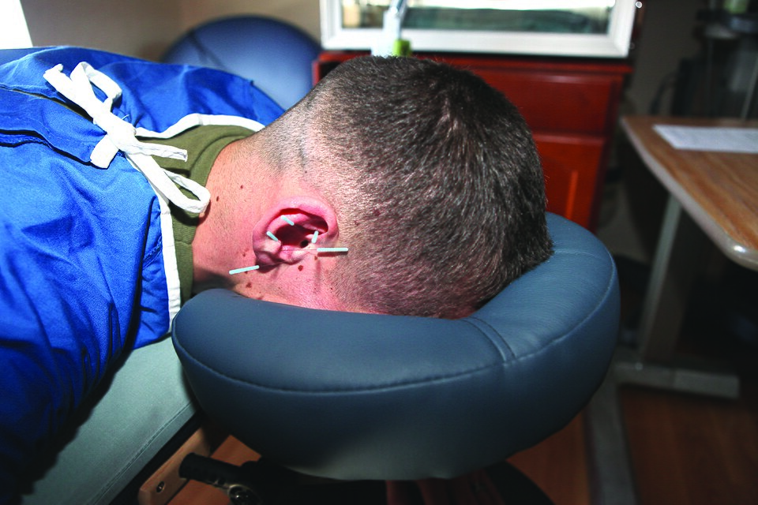

# 资料单 KP(3/3) — 运动后恢复管理与转介标准

**WIM 编码：** MP-031-3:2016-C03/KP(3/3)
**NOSS：** MP-031-3:2016 推拿疗法服务 (Level 3)
**CU：** C03 运动推拿服务 / Sport Tuina Service
**纸张颜色：** ⚪ 白页 (PUTIH)
**时数：** 20 小时（WA3 RK 全部）
**最后更新：** 2026-04-17

---

## 学习目标 / Learning Objectives

完成本资料单后，学员能够：
1. 评估运动推拿服务后的客户状况并比较术前记录
2. 制定运动员客户离场计划（休息、补水、补能、热/冷敷、回训计划）
3. 给予运动员客户健康生活与回训建议
4. 识别运动相关红旗征 (Red Flags) 并执行转介流程
5. 按 MOH 规范管理客户记录，保密 7 年
6. 安排持续运动推拿方案与复诊频率

---


*图 C03-3-1：针灸/推拿辅助慢性疼痛管理示意，可作为评估运动员服务后疼痛缓解度与制定多模式恢复方案的参考。来源：Wikimedia Commons / CC BY 4.0*

## 第一节　服务后状态评估

### 1.1 评估维度

| 维度 | 评估项目 | 量化方式 |
|------|----------|----------|
| **疼痛** | 部位、性质、缓解度 | VAS (0–10) 服务前后对比 |
| **活动度 (ROM)** | 患处主被动活动范围 | 量角器或对比对侧 |
| **肌张力** | 触诊结节、条索缓解情况 | 术者触感 + 客户主观 |
| **疲劳度** | RPE 自觉用力等级 | Borg 6–20 量表 |
| **情绪** | 放松、烦躁、嗜睡 | 客户自陈 |
| **生命体征** | 心率、呼吸、面色 | 术者观察 |

### 1.2 服务前后比较记录范本

```
项目        | 术前    | 术后    | 变化
腰右痛 VAS  | 7/10   | 3/10   | -4 ✓
腰前屈 ROM  | 60°    | 80°    | +20° ✓
RPE 自评    | 14/20  | 9/20   | -5 ✓
心率 (bpm)  | 88     | 76     | -12 ✓
情绪        | 烦躁   | 平稳   | 改善 ✓
```

---

## 第二节　运动员客户离场政策

### 2.1 离场前准备

1. **休息 5–10 分钟** — 客户保持原体位静卧；避免突然起身防体位性低血压
2. **补水** — 温开水 200–500 ml；运动员可加电解质
3. **告知正常反应** — 轻度淤青、嗜睡 24h、轻度酸胀 12–48h
4. **告知警示反应** — 深色尿、持续剧痛、神经放射痛 → 立即联系

### 2.2 起身与离场流程

1. 协助侧卧 → 坐起 → 静坐 30 秒 → 站立
2. 询问头晕、心慌情况
3. 引导更衣区
4. 提供温饮 + 简短建议卡

### 2.3 运动员专属离场建议

| 时机 | 建议 |
|------|------|
| **赛前推拿后** | 轻活动维持温度；避免立即剧烈热身；30 分钟内进入比赛/训练 |
| **赛后推拿后** | 24h 内不安排高强度训练；睡眠 ≥ 8 小时；冷热交替浴可选 |
| **慢性运动伤推拿后** | 48h 内回训强度降至 60%；按建议家庭自我护理 |

### 2.4 自我护理建议菜单

| 类别 | 建议 |
|------|------|
| **饮食** | 优质蛋白（1.2–2.0 g/kg/day）+ 抗炎食物（鱼油、姜黄、深色蔬果）；避免酒精 24h |
| **饮水** | 体重 (kg) × 35–40 ml；运动后另加 500 ml |
| **活动** | 24h 内轻活动；避免高强度训练 |
| **冷热敷** | 慢性僵硬：温敷 15 min × 2/天；亚急性肿胀：冷敷 10 min × 3/天 |
| **拉伸** | PNF / 静态拉伸 30 秒 × 3 组，每日 1 次 |
| **睡眠** | 8 小时；恢复期可加 20 分钟午睡 |
| **回训** | 按教练 + 推拿师建议渐进；监测疼痛 + RPE |

---

## 第三节　运动员转介标准 — Red Flags

### 3.1 立即急诊转介 (Emergency Referral)

| 红旗征 | 可能病因 |
|--------|----------|
| 深色尿 + 剧烈肌痛 + 虚弱 | 横纹肌溶解症 |
| 突发胸痛 + 心悸 + 冷汗 | 心血管事件 |
| 急性单侧腿肿热痛 | 深静脉血栓 (DVT) |
| 鞍区麻木 + 大小便失禁 | 马尾症候群 |
| 头部重击后呕吐 / 意识障碍 | 颅脑损伤 |
| 关节畸形 + 不能负重 | 骨折 / 脱位 |

### 3.2 一般转介 (Non-emergency Referral)

| 红旗征 | 转介对象 |
|--------|----------|
| 持续 4 周以上同部位疼痛未缓解 | 物理治疗师 / 骨科 |
| 神经放射痛、麻木、肌力下降 | 神经科 / 脊椎专科 |
| 不明原因体重下降 + 夜间盗汗 | 内科 |
| 慢性肿胀不退 | 风湿免疫 / 影像学 |
| 关节明显不稳定 | 骨科 / 运动医学 |
| 心理压力 / 比赛焦虑严重 | 运动心理师 |
| 营养不良 / 进食障碍 | 运动营养师 |

### 3.3 转介流程

```
红旗征识别 → 立即停止推拿 → 客户安抚 + 解释 →
告知转介必要性 → 取得客户口头同意 →
提供转介信 → 紧急时联系 999 →
完整记录于客户档案 → 跟进结果
```

### 3.4 转介信模板要素

- 客户姓名 / 出生日期 / 联系方式
- 转介日期 / 推拿师姓名 + 注册号
- 主诉与红旗征
- 推拿史摘要（次数、最近 1 次手法 + 部位）
- 已完成的评估
- 建议转介原因
- 推拿师签名 + 中心盖章

### 3.5 中心 / 推拿师能力限制

转介亦适用于：
- 客户病况超出 Level 3 推拿师能力
- 中心无相应设备
- 客户要求其他疗法（针灸 / 中药 / 西医）
- 客户家属或第三方主动请求

---

## 第四节　客户记录管理

### 4.1 MOH 规范要求

| 项目 | 要求 |
|------|------|
| **类型** | 手写或电脑化均可；电脑化须备份 |
| **保存** | 至少 7 年（成人）/ 至 18 岁后 7 年（未成年） |
| **保密** | 严守 PDPA 2010；锁柜或加密存储 |
| **修改** | 划线 + 签名 + 日期；不可涂改液或撕毁 |
| **同意书** | 每方案重新签署；每年至少更新 1 次 |

### 4.2 运动员客户档案应含项目

1. 基本资料
2. 运动项目 + 训练史 + 比赛日程
3. 既往伤病史（手术、骨折、扭伤、过敏）
4. 当前主诉 + VAS + ROM
5. 四诊记录
6. 服务方案（手法、部位、时长、频率）
7. 服务前后对比（每次）
8. 客户反馈与签名
9. 转介记录（如有）

### 4.3 服务后即时记录原则

- **24 小时内完成** 当日服务记录
- 使用客观语言
- 异常反应必须记录
- 推拿师每条记录均须签名 + 日期 + 时间

---

## 第五节　持续方案调整与复诊安排

### 5.1 方案有效性评估

| 评估周期 | 项目 |
|---------|------|
| **每次服务后** | VAS、ROM、客户主观满意度 |
| **每 4 周** | 综合疗效评估 + 方案调整决策 |
| **每 12 周** | 完整再评估 |

### 5.2 复诊频率建议

| 阶段 | 频率 |
|------|------|
| **急性恢复期** | 每周 2 次 × 2 周 |
| **慢性运动伤治疗** | 每周 1 次 × 4–6 周 |
| **维持保健** | 每 2–4 周 1 次 |
| **赛季支援** | 大赛前 1 周内 1 次 + 赛后 24h |
| **休赛期** | 每月 1 次 |

### 5.3 方案调整决策树

```
若 4 周后改善 < 30%：
  → 复核诊断 / 配穴
  → 调整手法力度与频率
  → 评估转介必要性
若 4 周后改善 ≥ 30% 但未完全：
  → 维持当前方案
若 4 周后基本痊愈：
  → 转入维持保健频率
若出现新红旗征：
  → 立即转介
```

---

## 第六节　MOH T&CM 伦理守则要点

1. **诚信** — 不夸大疗效；不承诺"100% 治愈"
2. **保密** — 客户信息、运动员伤情、训练隐私严守
3. **专业边界** — 不进行针刺、内服中药、物理治疗
4. **记录完整** — 即时、客观、可追溯
5. **持续教育** — 每年 ≥ 20 学时 CPD
6. **跨专业协作** — 与西医 / 教练 / 营养师

---

## 自评问题 / Self-Assessment

1. 列出服务后评估的 6 个维度。
2. 比较赛前、赛后、慢性运动伤推拿后的离场建议差异。
3. 列出 5 个立即急诊转介的红旗征。
4. 描述客户记录的 MOH 保存与修改规范。
5. 描述方案调整的决策树。

---

## 参考资料 / References
- NOSS MP-031-3:2016 — Tuinalogy Therapeutic Services
- MOH Code of Ethics for T&CM Practitioners 2007
- PDPA 2010
- Susan Findlay, Sports Massage
- ACSM Guidelines for Exercise Testing and Prescription
