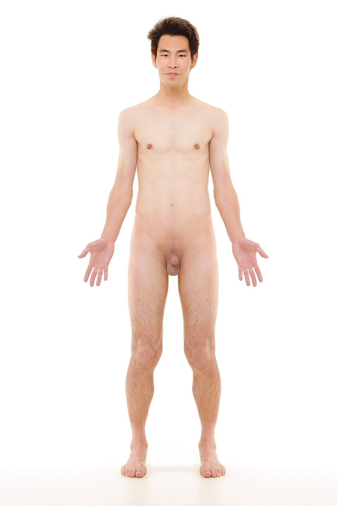

# 资料单 1：肌肉骨骼系统解剖（中西医结合）

**WIM 编码：** MP-031-3:2016-C04/KP(1/3)
**NOSS：** MP-031-3:2016 推拿疗法服务 (Level 3)
**CU：** C04 肌肉骨骼推拿服务
**纸张颜色：** 白
**时数：** 50 小时
**最后更新：** 2026-04-17
---

> ⚠️ **Pregnancy Contraindication** — GB-21 (肩井/Jianjing) mentioned in this document are forbidden during pregnancy at all trimesters per T&CM Act 2013 Section 28. Do NOT apply to pregnant clients. See `_reference/pregnancy-safety-reference.md`.

## 学习目标
1. 描述肌肉骨骼系统的主要组成结构
2. 区分骨、关节、肌肉、肌腱、韧带的功能差异
3. 识别 TCM 经络与西医肌肉骨骼系统的对应关系
4. 解释推拿手法作用于不同组织的机理

## 1. 肌肉骨骼系统概览 / Musculoskeletal System Overview

肌肉骨骼系统（Musculoskeletal System，简称 MSK）由 **骨骼**、**关节**、**肌肉**、**肌腱**、**韧带**、**筋膜** 与 **滑囊** 共同组成，承担支撑、保护、运动、造血与矿物质储存等功能。在中医学中，这一系统对应 **筋骨皮肉脉** 五体，受 **肝主筋、肾主骨、脾主肌肉** 等脏腑所主。

*图 1-1：人体前面观——肌肉骨骼推拿涉及的所有体表标志（锁骨、髂前上棘、髌骨、内外踝）均可在此参考图上对应定位。来源：Wikimedia Commons，CC0 公有领域奉献*

## 2. 骨骼系统 / Skeletal System

成人骨骼共 206 块，分为 **中轴骨**（颅骨、脊柱、胸廓）与 **附肢骨**（上、下肢带及四肢骨）。

*图 1-2：脊柱五段解剖图——颈椎 7 节（蓝）、胸椎 12 节（红）、腰椎 5 节（黄）、骶椎 5 节融合（绿）、尾椎 4 节融合（紫）。本图源自《Gray's Anatomy》，是 NOSS C04 脊柱推拿的解剖标准参考。来源：Wikimedia Commons，公有领域*

| 部位 | 主要骨 | 临床推拿关注点 |
|------|--------|----------------|
| 颈椎 | 颈椎 C1–C7 | 椎动脉、神经根受压 |
| 胸椎 | T1–T12 | 棘突排列、肋骨连接 |
| 腰椎 | L1–L5 | 椎间盘、棘突间隙 |
| 骶尾 | 骶 S1–S5、尾骨 | 骶髂关节稳定性 |
| 肩胛带 | 锁骨、肩胛骨、肱骨头 | 肩袖肌群附着 |
| 上肢 | 肱、桡、尺、腕、掌、指骨 | 肘外上髁、腕管 |
| 髋盆带 | 髂骨、坐骨、耻骨 | 骶髂关节、坐骨结节 |
| 下肢 | 股、髌、胫、腓、跗、跖、趾骨 | 膝关节面、踝韧带 |

**TCM 视角：** 「肾主骨生髓」，骨骼健康与肾精密切相关，老年骨质疏松属肾虚范畴。

## 3. 关节 / Joints

按结构分：
- **纤维关节** Fibrous（颅缝）— 不可动
- **软骨关节** Cartilaginous（椎间盘、耻骨联合）— 微动
- **滑膜关节** Synovial（肩、肘、膝、髋）— 可动；含关节囊、滑液、关节软骨

按运动方向分：
- 球窝（肩、髋）、铰链（肘、膝、指间）、车轴（寰枢）、椭圆（腕）、鞍状（拇指腕掌）、平面（腕骨间）

**推拿要点：** 关节操作必须在 **生理活动范围内**（ROM, Range of Motion）进行；任何超越 ROM 的扳法均属高风险，初级推拿师不得自行执行胸腰椎扳法。

*图 1-3：脊柱四个生理曲度——颈曲、胸曲、腰曲、骶曲。曲度异常（如胸椎后凸增加、腰椎前凸过度）是慢性腰背痛与肩颈僵硬的常见根源，是推拿评估的重点。来源：Wikimedia Commons / NCI SEER，公有领域*

## 4. 肌肉、肌腱与韧带 / Muscles, Tendons, Ligaments

*图 1-4：背部肌肉分层解剖——浅层斜方肌 (trapezius)、背阔肌 (latissimus dorsi)；中层菱形大/小肌 (rhomboids)、肩胛提肌 (levator scapulae)；深层竖脊肌 (erector spinae)。推拿手法层次必须与肌肉层次对应（轻揉 → 浅；按压 → 中深；肘点 → 深）。来源：Wikimedia Commons，CC BY-SA 4.0*

| 结构 | 功能 | 推拿手法对应 |
|------|------|--------------|
| 骨骼肌 Muscle | 收缩产生运动 | 揉、拿、按 |
| 肌腱 Tendon | 连接肌肉与骨 | 捻、按（避免暴力） |
| 韧带 Ligament | 连接骨与骨、稳定关节 | 不直接操作，避免拉伤 |
| 筋膜 Fascia | 包裹肌群、传导张力 | 推、摩 |
| 滑囊 Bursa | 减少摩擦 | 急性炎症时禁忌 |

**重要肌群与对应症状：**
- 颈：胸锁乳突肌、斜方肌上束、肩胛提肌 → 颈肩僵痛
- 肩：冈上肌、冈下肌、小圆肌、肩胛下肌（肩袖）→ 肩周炎
- 腰：竖脊肌、腰方肌、多裂肌 → 腰肌劳损
- 大腿：股四头肌、腘绳肌 → 膝痛代偿
- 小腿：腓肠肌、比目鱼肌 → 跟腱炎

## 5. TCM 经络与肌肉骨骼对应 / Meridian-MSK Mapping

| 经脉 | 循行路线（关节/肌相关段） | 常用穴 |
|------|---------------------------|--------|
| 手太阳小肠经 | 肩胛、颈外侧 | 天宗、肩贞 |
| 足太阳膀胱经 | 项后—腰背—腘窝—足 | 大杼、肾俞、委中、承山 |
| 足少阳胆经 | 头侧—肩—髋外—下肢外 | 风池、肩井、环跳、阳陵泉 |
| 督脉 | 腰背正中 | 命门、大椎 |
| 手阳明大肠经 | 肘外—肩前 | 曲池、手三里 |
| 足阳明胃经 | 大腿前—膝—小腿前 | 足三里、犊鼻 |

**临床要点：**「经脉所过，主治所及」— 关节痛多沿经脉循行选穴。

## 6. 关节生理活动范围（ROM）参考

| 关节 | 主要动作 | 正常范围 |
|------|----------|----------|
| 颈椎 | 屈/伸 | 45°/45° |
| 颈椎 | 侧屈/旋转 | 45°/60° |
| 肩 | 屈/外展 | 180°/180° |
| 肘 | 屈/伸 | 145°/0° |
| 腰椎 | 屈/伸 | 60°/25° |
| 髋 | 屈/伸 | 120°/30° |
| 膝 | 屈/伸 | 135°/0° |
| 踝 | 背屈/跖屈 | 20°/50° |

## 7. 软组织损伤分级（Grade I–III）

| 级别 | 表现 | 推拿处理 |
|------|------|----------|
| I 级 | 轻度拉伤，少量纤维断裂 | 24–72 小时后轻揉、远端取穴 |
| II 级 | 中度，明显疼痛、肿胀 | 急性期禁推；恢复期局部远部配合 |
| III 级 | 完全断裂、关节失稳 | **绝对禁忌**，立即转诊 |

## 8. 推拿安全与解剖危险区 / Anatomical Danger Zones

- **颈前三角**：颈动脉窦 — 禁压
- **腋窝**：臂丛神经 — 避免重压
- **肘内侧**：尺神经沟 — 麻木立即停止
- **腘窝**：胫神经、腘动静脉 — 仅轻揉
- **腹股沟**：股动脉 — 禁强压

## 9. 小结

肌肉骨骼推拿要求术者具备扎实的中西医结合解剖知识，理解组织层次（皮 → 筋膜 → 肌 → 腱 → 韧带 → 关节囊 → 骨），方能选择正确的手法、力度与方向。任何手法操作前必须先评估 ROM 与禁忌，以确保客户安全。

## 自我检查
1. 颈椎共有几节？哪一节是寰椎？
2. 肩袖由哪四块肌肉组成？
3. 「肾主骨」与骨质疏松有何关联？
4. 列出 3 个推拿绝对禁忌的解剖危险区。

## 参考资料
1. 解剖学（人卫版，第 9 版）
2. China National Tuina Standard Textbook, 13th Ed.
3. WHO Standard Acupuncture Locations
