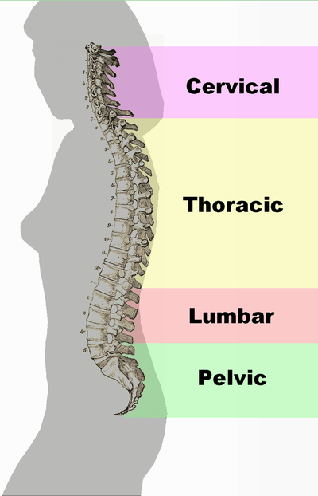
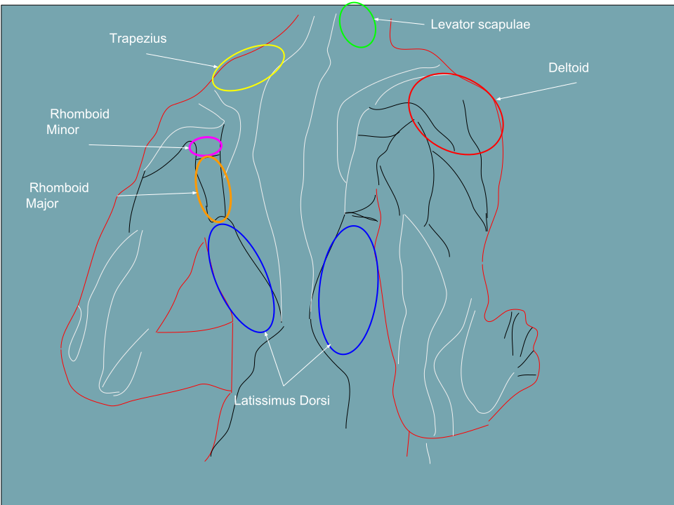

<!-- JPK_ENVELOPE_v1 -->
<table border="0" cellspacing="0" cellpadding="8" width="100%">
<tr>
<td width="130" valign="top"></td>
<td valign="middle">
<b>JABATAN PEMBANGUNAN KEMAHIRAN (JPK)</b> 
TINGKAT 7-8, BLOK D4, KOMPLEKS D, 
PUSAT PENTADBIRAN KERAJAAN PERSEKUTUAN, 
62530 PUTRAJAYA
</td>
</tr>
</table>

## KERTAS PENERANGAN

| Medan | Nilai |
| --- | --- |
| KOD DAN NAMA PROGRAM | MP-031-3:2016 PERKHIDMATAN TUINALOGI |
| TAHAP | 3 |
| KOD DAN TAJUK UNIT KOMPETENSI | MP-031-3:2016-C04 TUINALOGY SERVICES POST-TREATMENT |
| NO. DAN PERNYATAAN AKTIVITI KERJA | 1. CARRY OUT POST-TREATMENT EVALUATION 2. PROVIDE POST-TREATMENT ADVICE 3. PERFORM AREA AND EQUIPMENT CLEANING 4. RECORD POST-TREATMENT ACTIVITIES |
| NO. KOD | MP-031-3:2016-C04/KP(2/3) |
| Muka Surat | 1/1 |
| WARNA KERTAS | PUTIH (White) |

**TAJUK:** 资料单 2：常见肌肉骨骼问题与推拿手法

**TUJUAN:** > ⚠️ **Pregnancy Contraindication** — LI-4 (合谷/Hegu), GB-21 (肩井/Jianjing) mentioned in this document are forbidden during pregnancy at all trimesters per T&CM Act 2013 Section 28. Do NOT apply to pregnant clients. See `_reference/pregnancy-safety-reference.md`.

<!-- /JPK_ENVELOPE_v1 -->
# 资料单 2：常见肌肉骨骼问题与推拿手法

## 学习目标

1. 描述颈椎病、肩周炎、腰椎间盘突出症、腰肌劳损、网球肘、膝关节痛的病因病机（中西医结合）
2. 识别每种疾患的典型症状、体征与分型/分期
3. 掌握相应的推拿手法流程与关键穴位
4. 明确禁忌与高风险手法的权责界限
5. 判断何时需要转诊而非自行处理

---

> ⚠️ **Pregnancy Contraindication** — LI-4 (合谷/Hegu), GB-21 (肩井/Jianjing) mentioned in this document are forbidden during pregnancy at all trimesters per T&CM Act 2013 Section 28. Do NOT apply to pregnant clients. See `_reference/pregnancy-safety-reference.md`.

*图 C04-2-1：正常脊柱生理曲度与异常侧弯/前凸/后凸的对照，是颈椎病、腰椎病推拿评估的解剖学基础。来源：Wikimedia Commons / Public Domain*

## 1. 颈椎病 / Cervical Spondylosis

### 1.1 病因病机
- **西医：** 颈椎退行性变—椎间盘退变、骨质增生、韧带肥厚，压迫神经根、脊髓或椎动脉
- **TCM：** 肝肾亏虚为本，风寒湿痹、气滞血瘀为标；督脉、足太阳膀胱经受阻

### 1.2 常见分型

| 类型 | 典型症状 | 推拿适应性 |
|------|----------|------------|
| 颈型（落枕型）| 颈僵、活动受限 | 适合推拿 |
| 神经根型 | 颈肩臂放射痛、麻木 | 慎用、力度轻 |
| 椎动脉型 | 眩晕、转头诱发 | **旋转扳法禁用** |
| 脊髓型 | 四肢无力、步态异常 | **禁推、立即转诊** |
| 交感型 | 头痛、心悸、视物模糊 | 慎用 |

### 1.3 推拿手法流程（颈型 / 神经根型缓解期）
1. **体位：** 俯卧或端坐位
2. **舒筋：** 㨰法循颈肩—胸锁乳突肌、斜方肌上束、肩胛提肌，3–5 分钟
3. **点按：** 风池、天柱、肩井、肩中俞、大椎、阿是穴，每穴 30 秒
4. **弹拨：** 颈部条索、结节（避开椎动脉）
5. **拔伸：** 颈部纵向牵拉 10–15 秒 × 3 次（患者坐位，术者立其后）
6. **放松：** 揉按、擦法、拍法结束

### 1.4 关键禁忌
- 椎动脉型、脊髓型禁用旋转扳法
- 急性期红肿热痛禁推
- 颈动脉窦区域禁压

---

## 2. 肩周炎 / Frozen Shoulder（粘连性关节囊炎）

### 2.1 病因病机
- **西医：** 肩关节囊及周围软组织慢性炎症、粘连
- **TCM：** 年老体虚，风寒湿客于肩部经络；气血瘀滞不通

### 2.2 分期与推拿重点

| 分期 | 特征 | 推拿原则 |
|------|------|----------|
| 急性期（冻结前期）| 疼痛剧烈，夜间加重 | **禁重手法**，远端取穴为主 |
| 粘连期（冻结期）| 疼痛减轻，活动受限 | **重点施术**，松解粘连 |
| 解冻期（恢复期）| 活动度渐复 | 功能训练为主 |

### 2.3 推拿手法流程（粘连期）
1. **体位：** 仰卧或坐位
2. **温通：** 擦法于肩周，以透热为度
3. **松解：** 㨰法、揉法于三角肌、冈上肌、冈下肌、肩胛下肌，5–8 分钟
4. **点按：** 肩井、肩髃、肩髎、肩贞、天宗、臂臑、曲池，每穴 30–60 秒
5. **弹拨：** 肩胛下肌、冈下肌粘连带
6. **被动活动：** 肩关节前屈、外展、内旋、外旋、环转，循序增加幅度（忍受度内）
7. **扳法：** 肩关节扳法（前屈扳、外展扳）—仅粘连期使用，力度循序
8. **放松：** 搓肩、抖肩结束

### 2.4 关键禁忌
- 急性期剧痛、夜间痛不宁 — 禁重手法
- 糖尿病冰冻肩需配合内科管理
- 疑似肩袖完全撕裂（Drop Arm Test 阳性）立即转诊

---

*图 C04-2-2：腰背部肌肉解剖图，是腰椎间盘突出与腰肌劳损推拿手法路径设计的依据。来源：Wikimedia Commons / Public Domain*

## 3. 腰椎间盘突出症（非急性期） / Lumbar Disc Herniation

### 3.1 病因病机
- **西医：** 椎间盘纤维环破裂，髓核突出压迫神经根
- **TCM：** 肾虚为本，外感风寒湿 + 闪挫劳损；督脉、足太阳膀胱经瘀阻

### 3.2 典型症状
- 腰痛伴单侧下肢放射痛（坐骨神经分布）
- 咳嗽、喷嚏加重
- Lasegue 直腿抬高试验 (+)
- 拇趾背伸肌力下降（L5 受累）

### 3.3 推拿手法流程（非急性期、无马尾综合征）
1. **体位：** 俯卧，腹下垫枕
2. **舒筋：** 㨰法于腰背膀胱经第一、二侧线，竖脊肌、腰方肌，8–10 分钟
3. **点按：** 肾俞、大肠俞、关元俞、秩边、环跳、委中、承山、昆仑，每穴 30–60 秒
4. **弹拨：** 腰部痛点及臀中肌痉挛带
5. **斜扳（限受训合格者）：** 腰椎斜扳法 — **初级推拿师不得自行操作**
6. **下肢牵抖：** 患肢拔伸抖动 3–5 次
7. **放松：** 擦腰骶部、叩击腰背

### 3.4 关键禁忌与转诊指征
- **马尾综合征**（会阴麻木、大小便失禁）— **立即转诊，绝对禁推**
- 急性期剧痛、不能起床 — 卧床休息为先，禁重手法
- 进行性肌力下降 — 转骨科
- 影像学显示椎管严重狭窄、游离髓核 — 转骨科

---

## 4. 网球肘（肱骨外上髁炎）/ Tennis Elbow

### 4.1 病因病机
- **西医：** 伸腕肌群（尤其桡侧腕短伸肌）起点慢性劳损性炎症
- **TCM：** 劳损伤筋，气血瘀滞手阳明大肠经

### 4.2 典型症状
- 肘外侧疼痛，拧毛巾、握手加重
- Mill's test / Cozen's test (+)
- 肱骨外上髁局部压痛

### 4.3 推拿手法流程
1. **体位：** 坐位，患肢屈肘 90° 放于桌面
2. **舒筋：** 揉法于前臂伸肌群 3–5 分钟
3. **点按：** 曲池、手三里、手五里、少海、合谷、阿是穴（外上髁压痛点）
4. **弹拨：** 肱骨外上髁肌腱附着点（纵向弹拨）
5. **擦法：** 患处透热
6. **被动伸腕：** 缓慢拉伸伸腕肌群 10–15 秒 × 3 次
7. **整理：** 搓前臂、抖腕

### 4.4 关键禁忌
- 急性外伤 24h 内禁推
- 合并尺神经炎症状（小指麻）— 避开尺神经沟
- 保守治疗 3 月无效 — 建议医疗评估

---

## 5. 膝关节痛 / Knee Pain

### 5.1 常见证型

| 类型 | 特征 | 推拿策略 |
|------|------|----------|
| 髌骨软化症 | 上下楼梯痛、髌骨摩擦音 | 松解股四头肌、髌周按揉 |
| 退行性骨关节炎 | 晨僵、活动后缓解、老年人 | 经络温通、慎用关节扳法 |
| 膝内侧副韧带劳损 | 内侧压痛、外翻应力痛 | 局部揉、远端取穴 |
| 髌下脂肪垫炎 | 屈膝痛、髌尖压痛 | 轻柔松解 |

### 5.2 推拿手法流程（退行性膝关节痛）
1. **体位：** 仰卧，膝下垫枕屈曲 15°
2. **舒筋：** 揉法于股四头肌、髌周、腘窝（轻）
3. **点按：** 血海、梁丘、犊鼻、内膝眼、阳陵泉、足三里、阴陵泉、委中，每穴 30 秒
4. **弹拨：** 髌骨支持带、髌韧带
5. **髌骨活动：** 髌骨上下左右推动（轻柔，排除积液后）
6. **屈伸膝关节：** 被动屈伸 5–10 次（ROM 内）
7. **擦法：** 膝周透热
8. **下肢整理：** 抖腿、揉腓肠肌、承山

### 5.3 关键禁忌
- 关节腔积液、急性红肿热痛 — 禁推
- 疑似半月板完全撕裂（McMurray 阳性 + 交锁）— 转骨科
- 骨质疏松严重患者慎用暴力扳法
- 人工膝关节置换术后 6 月内 — 禁推，转康复医师

---

## 6. 分部位手法综合速查

| 部位 | 核心手法 | 核心穴位 | 关键禁区 |
|------|----------|----------|----------|
| 颈部 | 㨰、揉、点按、拔伸 | 风池、天柱、肩井、大椎 | 颈动脉窦、椎动脉型 |
| 肩部 | 㨰、揉、弹拨、扳、搓抖 | 肩井、肩髃、肩髎、天宗 | 急性期禁重手法 |
| 腰部 | 㨰、按、弹拨、斜扳* | 肾俞、大肠俞、委中、承山 | 马尾综合征绝对禁忌 |
| 肘部 | 揉、弹拨、擦、拉伸 | 曲池、手三里、少海、合谷 | 尺神经沟 |
| 膝部 | 揉、点按、髌骨活动、擦 | 犊鼻、阳陵泉、足三里、血海 | 腘窝血管神经束 |

*斜扳法须经合格督导与继续教育方可独立操作。

---

## 7. 客户反应观察与紧急情况

### 7.1 正常反应
- 局部酸胀温热、轻度疲倦、排尿增多

### 7.2 异常反应（立即停止手法，评估/转诊）
- 突发眩晕、恶心（椎动脉缺血可能）
- 肢体麻木加重、肌力下降
- 剧烈放射痛不缓解
- 面色苍白、出冷汗、心慌（血管迷走反射或心源性）
- 晕厥

### 7.3 处置
- 立即停止手法；平卧，保持气道通畅
- 监测脉搏、呼吸、意识
- 必要时启动急救（AED、拨打 999）
- 24 小时内书面记录并告知督导

---

## 8. 小结

肌肉骨骼推拿的安全性与有效性建立在三个支柱：**准确的评估辨证**、**严格的禁忌把关**、**分部位精细手法**。颈椎病、肩周炎、腰椎间盘突出症、网球肘、膝关节痛是 Level 3 推拿师在门诊最常遇到的五类问题；每一类都有"红线"——凡属脊髓型、马尾综合征、关节完全断裂、急性炎症、肿瘤 — 一律转诊，绝不自行处理。

## 自我检查
1. 椎动脉型颈椎病为什么禁用颈部旋转扳法？
2. 肩周炎"冻结期"与"解冻期"推拿重点有何不同？
3. 出现马尾综合征应如何处置？
4. 网球肘的典型阳性体征是哪两个？
5. 膝关节腔积液患者能否推拿？为什么？

## 参考资料
1. 严隽陶《推拿学》（人卫版，第 9 版）
2. 《临床常见病推拿治疗学》
3. China National Tuina Standard Textbook, 13th Ed.
4. WHO Standard Acupuncture Locations