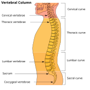
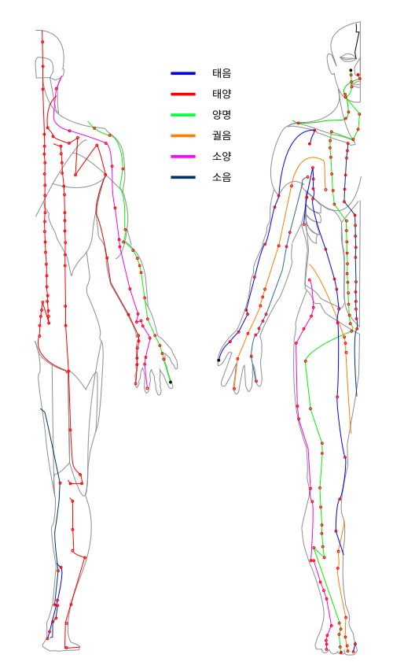

<!-- JPK_ENVELOPE_v1 -->
<table border="0" cellspacing="0" cellpadding="8" width="100%">
<tr>
<td width="130" valign="top"></td>
<td valign="middle">
<b>JABATAN PEMBANGUNAN KEMAHIRAN (JPK)</b> 
TINGKAT 7-8, BLOK D4, KOMPLEKS D, 
PUSAT PENTADBIRAN KERAJAAN PERSEKUTUAN, 
62530 PUTRAJAYA
</td>
</tr>
</table>

## KERTAS PENERANGAN

| Medan | Nilai |
| --- | --- |
| KOD DAN NAMA PROGRAM | MP-031-3:2016 PERKHIDMATAN TUINALOGI |
| TAHAP | 3 |
| KOD DAN TAJUK UNIT KOMPETENSI | MP-031-3:2016-E01 TUINALOGY SERVICES PROMOTION |
| NO. DAN PERNYATAAN AKTIVITI KERJA | 1. IDENTIFY PROMOTION REQUIREMENTS 2. PREPARE PROMOTION MATERIALS 3. EXECUTE PROMOTION ACTIVITIES 4. EVALUATE PROMOTION EFFECTIVENESS |
| NO. KOD | MP-031-3:2016-E01/KP(1/3) |
| Muka Surat | 1/1 |
| WARNA KERTAS | PUTIH (White) |

**TAJUK:** 资料单 1：小儿生理特点与小儿经络（与成人差异）

**TUJUAN:** 阅读完本资料单后，学员应能够：

<!-- /JPK_ENVELOPE_v1 -->
# 资料单 1：小儿生理特点与小儿经络（与成人差异）

## 一、学习目标

阅读完本资料单后，学员应能够：
1. 描述 0–6 岁婴幼儿的生理与解剖特点；
2. 说明小儿经络发育的特殊性；
3. 比较小儿与成人在推拿评估中的差异；
4. 识别小儿推拿前必须完成的安全核查项目。

## 二、小儿推拿概述 / Introduction to Paediatric Tuina

小儿推拿（Paediatric Tuina / 小儿推拿 Xiǎo'ér Tuīná）是中医推拿（Tuina）的专门分支，专门用于 **0–6 岁婴幼儿**。其历史可上溯至明代——《小儿推拿广意》（熊应雄著）系统总结小儿专属手法与穴位；清代《幼科铁镜》（夏鼎著）进一步完善小儿病诊疗体系。NOSS 第 5 页明确指出：在唐代（公元 618–907 年）小儿推拿已具雏形，至明代（1368–1644 年）发展为独立学派。

小儿推拿的核心目标是**调节气（Qi）的循环**，达到改善：
- 消化（Digestion）— 食欲、排便
- 呼吸（Respiration）— 缓解感冒、咳嗽
- 神志（Spirit）— 改善睡眠、缓解夜啼
- 整体生长发育（Growth & Development）

> **重要边界：** 小儿推拿是**辅助调理**而非替代医疗。任何急症、感染性疾病、外伤皆须由医院诊治。

## 三、小儿生理特点 / Paediatric Physiology

中医经典《小儿药证直诀》（钱乙）总结小儿"三大生理特点"：

| 特点 | 中文 | 含义 | 推拿意义 |
|------|------|------|----------|
| Tender organs | 脏腑娇嫩 | 五脏六腑功能尚未健全 | 力度必须**轻柔**，避免直接深推 |
| Qi & form not full | 形气未充 | 气血、肌肉、骨骼仍在发育 | 时间宜**短**（5–30 分钟）|
| Vigorous vitality | 生机蓬勃 | 复原力强，反应迅速 | 见效快，方案需及时调整 |

*图 1-1：成人脊柱解剖图——颈、胸、腰、骶、尾五段共 33 节椎骨。婴幼儿脊柱含大量软骨且骨化未完成（尤其骶尾段），是小儿推拿"捏脊"必须力度极轻的解剖原因。来源：Wikimedia Commons / Arcadian, Pixelsquid，公有领域*

### 3.1 解剖差异

| 项目 | 婴幼儿（0–6 岁） | 成人 |
|------|-----------------|------|
| 皮肤 | 薄、嫩、含水量高 | 较厚 |
| 骨骼 | 软骨多、骨化未完成 | 完全骨化 |
| 头颅 | 1 岁前前囟门未闭 | 完全闭合 |
| 肌肉 | 体积小、力量弱 | 充实 |
| 内脏 | 相对位置较高、肝大 | 标准定位 |
| 体温调节 | 不稳定 | 稳定 |
| 免疫力 | 低（易感染） | 较高 |

### 3.2 力度与时间参考表

| 年龄 | 力度（指压） | 单次时长 | 注意 |
|------|------------:|---------:|------|
| 0–3 月 | 极轻（如抚触） | 5–10 分钟 | 必须有家长抱姿 |
| 3–12 月 | 轻 | 10–15 分钟 | 注意囟门、避开 |
| 1–3 岁 | 较轻 | 15–20 分钟 | 玩具配合安抚 |
| 3–6 岁 | 中等偏轻 | 20–30 分钟 | 可仰卧/俯卧 |

> **绝对原则：** 婴幼儿期**严禁**使用成人 deep pressure 或运动推拿手法。

## 四、小儿经络系统 / Paediatric Meridian System

*图 1-2：十二经络与十二时辰对应总图——小儿的十二经络系统遵循与成人相同的循行路径，但经气浮于体表。本图可帮助学员理解小儿"线状穴"如脾经（拇指桡侧）、肺经（无名指）等，与成人手太阴肺经、足太阴脾经的关系。来源：Wikimedia Commons (Pk0001)，CC BY-SA 4.0*

### 4.1 经络发育特点

NOSS 第 23 页指出：婴儿的经络（Meridians）系统**尚未完全发育**（not fully developed），但深受气流影响。因此小儿经络具有：

1. **浅表性 (Superficial)**：经气浮于体表，浅推即可调动；
2. **敏感性 (Sensitive)**：少量刺激即生显著反应；
3. **可塑性 (Plastic)**：易受调整，亦易受错误操作所伤；
4. **特定线状穴 (Linear Acupoints)**：小儿独有"线状穴"概念，与成人"点状穴"不同。

### 4.2 小儿专属穴位（基础）

#### 4.2.1 头面部（点状穴）

| 中文 | 拼音 | English | 位置 | 主治 |
|------|------|---------|------|------|
| 天门 | Tiānmén | Heaven Gate | 两眉中点至前发际成一直线 | 感冒、头痛、安神 |
| 坎宫 | Kǎngōng | Kan Palace | 眉毛之间，沿眉弓 | 外感、惊风 |
| 太阳 | Tàiyáng | Tai Yang | 眉梢与外眼角之间凹陷 | 头痛、感冒 |

#### 4.2.2 上肢线状穴（小儿独有）

线状穴位于手指两侧或手掌特定线段，是小儿推拿核心。

| 中文 | 拼音 | 位置 | 操作方向 | 主治 |
|------|------|------|----------|------|
| 脾经 | Píjīng | 拇指桡侧缘 | 由指尖→指根（补） | 食欲不振、腹泻 |
| 肝经 | Gānjīng | 食指掌面 | 由指根→指尖（清） | 烦躁、惊风 |
| 心经 | Xīnjīng | 中指掌面 | 由指根→指尖（清） | 心烦、口疮 |
| 肺经 | Fèijīng | 无名指掌面 | 由指根→指尖（清） | 咳嗽、感冒 |
| 肾经 | Shènjīng | 小指掌面 | 由指尖→指根（补） | 体虚、遗尿 |
| 大肠 | Dàcháng | 食指桡侧缘 | 由指根→指尖（清）/ 反向（补）| 便秘、腹泻 |
| 小肠 | Xiǎocháng | 小指尺侧缘 | 由指根→指尖（清）| 小便不利 |
| 三关 | Sānguān | 前臂桡侧（腕→肘）| 由腕→肘（推）| 体虚、寒证 |
| 六腑 | Liùfǔ | 前臂尺侧（肘→腕）| 由肘→腕（推）| 高热、便秘 |
| 天河水 | Tiānhéshuǐ | 前臂正中（腕→肘）| 由腕→肘（清）| 发热（清热）|
| 板门 | Bǎnmén | 手掌大鱼际 | 揉 | 消食、止吐 |
| 内八卦 | Nèibāguà | 手掌掌心圆周 | 顺时针运 | 胸闷、咳嗽、消食 |

> **方向决定补泻：** "向心为补，离心为清"是大致原则，但每条线状穴的传统方向规定不同，必须严格按典籍。

#### 4.2.3 胸腹与背部

| 中文 | 位置 | 操作 | 主治 |
|------|------|------|------|
| 中脘 | 脐上 4 寸 | 揉 | 消化不良 |
| 天枢 | 脐旁 2 寸 | 揉 | 腹泻、便秘 |
| 脐 | 肚脐 | 摩、揉 | 腹痛、肠功能 |
| 脊柱（捏脊）| 大椎→长强 | 由下而上捏 | 体虚、消化、免疫 |
| 肺俞 | 第 3 胸椎旁 | 揉 | 咳嗽 |
| 脾俞 | 第 11 胸椎旁 | 揉 | 食欲 |
| 肾俞 | 第 2 腰椎旁 | 揉 | 遗尿、体虚 |

## 五、小儿四诊（以望诊为主） / Four Diagnostic Methods (Observation-led)

成人四诊以"切（脉）"为重，小儿则以"望"为主，因小儿不能准确陈述病情、脉象细难辨。

| 诊法 | 小儿应用要点 |
|------|--------------|
| **望** Wàng | 望神色（精神好坏）、望面色（青、赤、黄、白、黑五色）、望指纹（食指三关：风/气/命）、望舌、望大便 |
| **闻** Wén | 听哭声（响亮 vs 微弱）、听咳声、闻口气、闻大便气味 |
| **问** Wèn | 由家长代答：饮食、睡眠、大小便、出汗、既往疾病 |
| **切** Qiē | 触摸额头温度、腹部软硬、囟门、肌肤弹性；不强求脉诊 |

### 5.1 望指纹（小儿独特诊法）

3 岁以下幼儿，观察食指内侧浅静脉（"虎口三关"）：

| 关 | 部位 | 临床意义 |
|----|------|----------|
| 风关 | 第一节 | 病轻 |
| 气关 | 第二节 | 病重 |
| 命关 | 第三节 | 危重，需即转医 |

颜色辨证：青主惊风、红主寒热、紫主热盛、黑主危重。

## 六、小儿推拿前的安全核查清单

每次施术前**必须**完成以下核查（与家长共同确认）：

- [ ] 小儿身份与档案对应
- [ ] 体温正常（< 37.5°C）
- [ ] 无急性症状（呕吐、抽搐、严重腹泻、意识异常）
- [ ] 无开放性伤口、皮肤病、传染病（手足口、水痘等）
- [ ] 无骨折、关节肿胀
- [ ] 进食后已隔 30–60 分钟（避免吐奶）
- [ ] 家长知情同意书已签署
- [ ] 环境温度 26–28°C，无对流风
- [ ] 介质为婴儿专用低敏配方
- [ ] 操作者指甲已修剪、双手已消毒并搓暖

> **任何一项不符合，必须暂停或转介。**

## 七、关键术语对照表

| 中文 | 拼音 | English |
|------|------|---------|
| 小儿推拿 | Xiǎo'ér Tuīná | Paediatric Tuina |
| 线状穴 | Xiànzhuàng xué | Linear acupoint |
| 面状穴 | Miànzhuàng xué | Areal acupoint |
| 望诊 | Wàngzhěn | Observation diagnosis |
| 望指纹 | Wàng zhǐwén | Finger vein observation |
| 风关/气关/命关 | Fēng/Qì/Mìng guān | Wind/Qi/Life pass |
| 脏腑娇嫩 | Zàngfǔ jiāonèn | Tender organs |
| 形气未充 | Xíngqì wèichōng | Form & qi not full |

## 八、自我检测题（参见 KT-01）

阅读后请完成 `KT-01.md`。

## 九、参考文献

1. 熊应雄（明）《小儿推拿广意》
2. 夏鼎（清）《幼科铁镜》
3. 钱乙（宋）《小儿药证直诀》
4. China National Tuina Standard Textbook 13th Edition (2003)
5. NOSS MP-031-3:2016 第 5、23、57–65 页