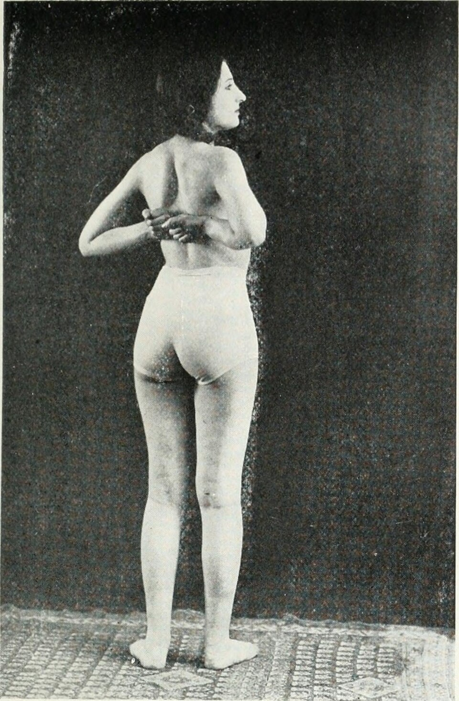
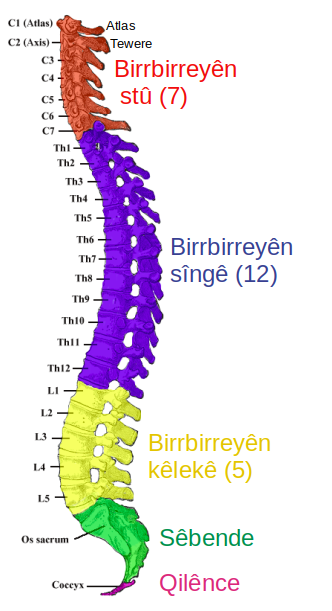

<!-- JPK_ENVELOPE_v1 -->
<table border="0" cellspacing="0" cellpadding="8" width="100%">
<tr>
<td width="130" valign="top"></td>
<td valign="middle">
<b>JABATAN PEMBANGUNAN KEMAHIRAN (JPK)</b> 
TINGKAT 7-8, BLOK D4, KOMPLEKS D, 
PUSAT PENTADBIRAN KERAJAAN PERSEKUTUAN, 
62530 PUTRAJAYA
</td>
</tr>
</table>

## KERTAS PENERANGAN

| Medan | Nilai |
| --- | --- |
| KOD DAN NAMA PROGRAM | MP-031-3:2016 PERKHIDMATAN TUINALOGI |
| TAHAP | 3 |
| KOD DAN TAJUK UNIT KOMPETENSI | MP-031-3:2016-E01 TUINALOGY SERVICES PROMOTION |
| NO. DAN PERNYATAAN AKTIVITI KERJA | 1. IDENTIFY PROMOTION REQUIREMENTS 2. PREPARE PROMOTION MATERIALS 3. EXECUTE PROMOTION ACTIVITIES 4. EVALUATE PROMOTION EFFECTIVENESS |
| NO. KOD | MP-031-3:2016-E01/KP(2/3) |
| Muka Surat | 1/1 |
| WARNA KERTAS | PUTIH (White) |

**TAJUK:** 资料单 2：小儿推拿专属手法与穴位

**TUJUAN:** 完成本资料单后，学员应能：

<!-- /JPK_ENVELOPE_v1 -->
# 资料单 2：小儿推拿专属手法与穴位

## 一、学习目标

完成本资料单后，学员应能：
1. 准确说明 9 种小儿推拿专属手法的操作要领；
2. 演示线状穴的方向、速度与频次；
3. 区分"补"与"清"在不同穴位上的方向规则；
4. 使用 NOSS 第 76–78 页所列专业术语描述手法。

*图 2-1：传统手法医学历史教学插图——展示推、揉、捏等手法的标准操作姿势。小儿推拿沿用同源手法但力度极轻、时间极短。来源：Wikimedia Commons / Internet Archive Book Images，公有领域*

## 二、小儿推拿八大基本手法（NOSS 第 76–80 页）

NOSS 标准列出小儿推拿基本手法包括：直推法 (zhí tuī fǎ)、分推法 (fēn tuī fǎ)、揉法 (rou fa)、摩法 (mo fa)、捏法 (nie fa)、按法 (an fa)、掐法 (qia fa)、运法 (yun fa)。本节增加传统典籍常见的捣法 (dǎo fǎ)，共九法。

### 2.1 推法（直推 / 分推 / 旋推）

| 类型 | 拼音 | 操作 | 频率 | 用例 |
|------|------|------|------|------|
| 直推法 | zhí tuī fǎ | 拇指或食/中指沿直线单向推动 | 200–300 次/分 | 开天门、推三关、推天河水 |
| 分推法 | fēn tuī fǎ | 双拇指自中央向两侧分推 | 100–200 次/分 | 推坎宫、分推膻中 |
| 旋推法 | xuán tuī fǎ | 拇指作圆周推动 | 150–200 次/分 | 旋推脾经（补） |

**要领：** 着力部位贴皮肤；速度均匀；不可使用滑动按压（以免擦伤）；必须借助介质（婴儿油 / 滑石粉）。

### 2.2 揉法 (Róu fǎ / Kneading)

NOSS 描述：以一指、二指、三指、掌、大鱼际或拇指压于穴位/区域，作不离皮的圆周回旋。

- 频率：100–160 次/分
- 时间：每穴 1–3 分钟
- 用例：揉板门（消食）、揉中脘（健脾）、揉肺俞（止咳）

### 2.3 摩法 (Mó fǎ / Circular Rubbing)

NOSS 描述：四指或掌面在腹部作圆周表面摩擦，**不带动深层组织**，用于腹痛、便秘、腹泻。

- 顺时针摩腹 → 通便（泻）
- 逆时针摩腹 → 止泻（补）
- 频率：100–120 次/分
- 时间：3–5 分钟

### 2.4 捏法 (Niē fǎ / Pinching) — 含"捏脊"

NOSS 描述：拇食指捏起少量肌肉提捏，用于脊柱旁肌肉。

*图 2-2：脊柱五段解剖图——捏脊法沿督脉与膀胱经第一侧线（脊柱旁开 0.5–1.5 寸）从长强穴（尾椎）向上推捏至大椎穴（C7 棘突下）。本图展示完整脊柱节段供定位参考。来源：Wikimedia Commons / Gray's Anatomy，公有领域*

**捏脊法（traditional spinal pinching）：**
1. 小儿俯卧；
2. 双手拇指与食、中指对捏脊柱旁皮肤；
3. 由长强（尾椎）向上推捏至大椎（颈下）；
4. 一般 3–5 遍；第 4、5 遍每捏 3 下提拉一次（"捏三提一"）。

**主治：** 体虚、消化不良、夜啼、免疫低下，是小儿保健核心手法之一。

### 2.5 按法 (Àn fǎ / Pressing)

拇指或掌按压穴位维持 3–10 秒，再缓慢放松。**婴儿期（< 1 岁）力度极轻**。常配合揉法形成"按揉"复合手法。

### 2.6 掐法 (Qiā fǎ / Nipping)

拇指甲轻掐特定急救穴位（如人中、十宣）。**强刺激**手法，仅用于急救（如惊风、晕厥）；掐后必须以揉法缓和。每穴 3–5 次。

### 2.7 运法 (Yùn fǎ / Circle Pushing)

NOSS 描述：用拇指作温和而稳定的圆周运动，常用于手掌（运内八卦）。

**运内八卦：** 以掌心为中心，约掌心至中指根 2/3 处为半径作圆，顺时针为顺运（行气、止咳），逆时针为逆运（降气、止呕）。每次 100–300 圈。

### 2.8 捣法 (Dǎo fǎ / Tapping with finger tip)

中指端轻捣特定穴位（如捣小天心治惊风、夜啼），3–5 次。

## 三、典型穴位详解

### 3.1 上肢线状穴方向口诀

> "向心为补，离心为清；脾肾为补，肝心肺清；大肠双向，三关六腑分阴阳。"

| 穴位 | 补法（向心）| 清法（离心）| 一次次数 |
|------|------------|------------|----------|
| 脾经 | 由指尖→指根 | 由指根→指尖 | 100–500 |
| 肾经 | 由指尖→指根 | — | 100–500 |
| 肝经 | — | 由指根→指尖 | 100–300 |
| 心经 | — | 由指根→指尖 | 100–300（慎用，多以揉劳宫代）|
| 肺经 | 由指尖→指根 | 由指根→指尖 | 100–500 |
| 大肠 | 由指尖→虎口 | 由虎口→指尖 | 100–300 |

### 3.2 经典处方穴位（详见 KP-03）

- **清天河水**：前臂正中，由腕→肘直推 100–500 次。**清热**首选，发热必备。
- **推三关**：前臂桡侧，由腕→肘直推 100–300 次。**温阳散寒**。
- **退六腑**：前臂尺侧，由肘→腕直推 100–300 次。**清实热**，与三关相反。
- **揉板门**：手掌大鱼际，揉 100–300 次。**消食和胃**。
- **运内八卦**：见 §2.7。
- **摩腹**：见 §2.3。
- **捏脊**：见 §2.4。

## 四、介质（NOSS 第 65 页 TEM 第 9 项）

| 介质 | 中文 | 适用 | 注意 |
|------|------|------|------|
| 婴儿油 | Baby oil | 一般润滑 | 选无香低敏 |
| 滑石粉 | Talcum powder | 多汗、夏季 | 避免吸入 |
| 凉水 | Cool water | 清热（清天河水时蘸水）| 室温即可，不冰 |
| 葱姜水 | Scallion-ginger decoction | 风寒感冒（推三关时蘸用）| 现配现用 |
| TCM 草本液 | Herbal liquid | 特定症状（医师配方）| 须先做皮肤敏感测试 |

> **皮肤敏感测试：** 任何新介质首次使用前，需在小儿前臂内侧涂少量观察 15 分钟，无红疹方可使用。

## 五、操作环境与卫生

依据 NOSS WA2 RK iii（一般感染控制要求）：

- 推拿床每次服务后以 70% 酒精擦拭；
- 床单一次性或一客一换；
- 推拿师指甲剪短磨平、不戴戒指；
- 双手以肥皂水洗 20 秒，再以酒精消毒；
- 介质瓶禁止再灌装、禁止接触小儿皮肤后回触瓶口；
- 室温 26–28°C，无对流风，光线柔和；
- 玩具每日紫外线消毒。

## 六、常见错误与纠正

| 错误 | 后果 | 纠正 |
|------|------|------|
| 力度过重 | 皮肤瘀紫、哭闹 | 改用指腹、降速 |
| 方向反向 | 补泻颠倒，加重病情 | 复习线状穴方向 |
| 不用介质 | 擦伤皮肤 | 必须使用婴儿油/粉 |
| 时间过长 | 小儿疲倦、抗拒 | 严格按年龄时长表 |
| 推后未保暖 | 受凉感冒 | 立即穿衣盖被 |
| 推前未核查禁忌 | 加重急症 | 完成 KP-01 §6 清单 |

## 七、关键术语补充

| 中文 | 拼音 | English |
|------|------|---------|
| 直推法 | zhí tuī fǎ | Straight pushing |
| 分推法 | fēn tuī fǎ | Pushing apart |
| 揉法 | róu fǎ | Kneading |
| 摩法 | mó fǎ | Circular rubbing |
| 捏法 | niē fǎ | Pinching |
| 按法 | àn fǎ | Pressing |
| 掐法 | qiā fǎ | Nipping |
| 运法 | yùn fǎ | Circle pushing |
| 捣法 | dǎo fǎ | Tip tapping |
| 捏脊 | niē jǐ | Spinal pinching |
| 介质 | jièzhì | Tuina media |

## 八、自我检测（参见 KT-02）

阅读后请完成 `KT-02.md`。

## 九、参考文献

1. NOSS MP-031-3:2016 第 76–80 页（小儿手法详细描述）
2. 熊应雄《小儿推拿广意》
3. 张汉臣《实用小儿推拿》
4. China National Tuina Standard Textbook 13th Edition