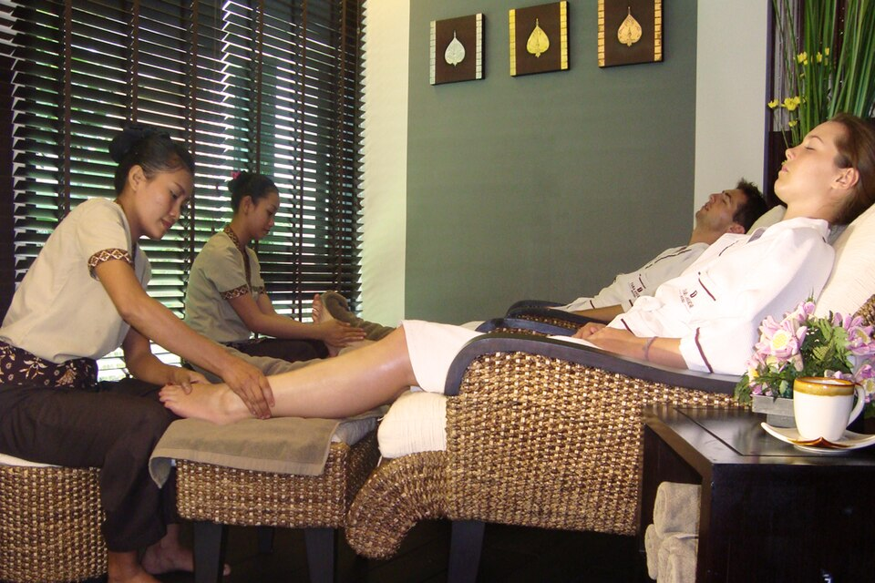

<!-- JPK_ENVELOPE_v1 -->
<table border="0" cellspacing="0" cellpadding="8" width="100%">
<tr>
<td width="130" valign="top"></td>
<td valign="middle">
<b>JABATAN PEMBANGUNAN KEMAHIRAN (JPK)</b> 
TINGKAT 7-8, BLOK D4, KOMPLEKS D, 
PUSAT PENTADBIRAN KERAJAAN PERSEKUTUAN, 
62530 PUTRAJAYA
</td>
</tr>
</table>

## KERTAS PENERANGAN

| Medan | Nilai |
| --- | --- |
| KOD DAN NAMA PROGRAM | MP-031-3:2016 PERKHIDMATAN TUINALOGI |
| TAHAP | 3 |
| KOD DAN TAJUK UNIT KOMPETENSI | MP-031-3:2016-E01 TUINALOGY SERVICES PROMOTION |
| NO. DAN PERNYATAAN AKTIVITI KERJA | 1. IDENTIFY PROMOTION REQUIREMENTS 2. PREPARE PROMOTION MATERIALS 3. EXECUTE PROMOTION ACTIVITIES 4. EVALUATE PROMOTION EFFECTIVENESS |
| NO. KOD | MP-031-3:2016-E01/KP(3/3) |
| Muka Surat | 1/1 |
| WARNA KERTAS | PUTIH (White) |

**TAJUK:** 资料单 3：常见小儿不适推拿调理

**TUJUAN:** 完成本资料单后，学员应能：

<!-- /JPK_ENVELOPE_v1 -->
# 资料单 3：常见小儿不适推拿调理

## 一、学习目标

完成本资料单后，学员应能：
1. 列出 8 种常见小儿不适的推拿调理方案；
2. 说明每个方案的辨证要点（寒/热/虚/实）；
3. 识别"必须立即转介医院"的警讯；
4. 向家长清晰解释家庭辅助护理。

*图 E01-3-1：足部反射按摩示意，可作为小儿消化、睡眠不适的辅助保健参考。来源：Wikimedia Commons / CC BY 2.0*

## 二、调理总原则

1. **辨证施治** — 同一症状（如腹泻）有寒、热、伤食、脾虚四型，处方不同。
2. **保健为主，辅助治疗** — 推拿不替代医院治疗。
3. **三必查** — 体温、精神状态、症状持续时间。
4. **三不推** — 急性期高热抽搐、严重脱水、皮肤感染。

## 三、八大常见症状调理

### 3.1 消化不良 (Indigestion / 积滞)

**辨证：** 食欲差、口臭、腹胀、舌苔厚腻、大便酸臭。

**处方（每次 15–20 分钟）：**

| 步骤 | 穴位/手法 | 次数/时长 | 说明 |
|------|-----------|-----------|------|
| 1 | 揉板门 | 100–300 | 消食化积 |
| 2 | 清大肠 | 100–300 | 通腑导滞 |
| 3 | 摩腹（顺时针） | 3–5 分 | 助消化 |
| 4 | 揉中脘 | 1–2 分 | 健脾和胃 |
| 5 | 揉天枢 | 1–2 分 | 调理肠道 |
| 6 | 捏脊（向上） | 3–5 遍 | 提升整体 |

**家庭辅助：** 暂减食量、温米粥；忌生冷油腻；适度散步。

**警讯转医：** 持续呕吐 > 6 小时、剧烈腹痛、呕血、便血。

---

> ⚠️ **Pregnancy Contraindication** — LI-4 (合谷/Hegu) mentioned in this document are forbidden during pregnancy at all trimesters per T&CM Act 2013 Section 28. Do NOT apply to pregnant clients. See `_reference/pregnancy-safety-reference.md`.

### 3.2 便秘 (Constipation / 便秘)

**辨证：** 大便干硬、3 日以上未解。常分实热型（伴口臭、烦躁）与虚证（伴精神差、食欲低）。

**处方：**

| 步骤 | 手法 | 次数 |
|------|------|------|
| 1 | 清大肠 | 200–500 |
| 2 | 退六腑（实热型） | 100–300 |
| 3 | 摩腹（顺时针） | 5 分 |
| 4 | 揉天枢 | 2 分 |
| 5 | 推下七节骨（由上而下，泻法） | 100–300 |
| 6 | 揉龟尾 | 1–2 分 |

**家庭辅助：** 增饮水、添加蔬果泥、火龙果汁；按摩腹部；养成定时如厕习惯。

**警讯转医：** 便血、剧痛、肛裂、超过 7 日未解、伴呕吐。

---

### 3.3 腹泻 (Diarrhoea / 泄泻)

**辨证四型：**
- **寒湿型**：大便清稀、腹冷喜温
- **湿热型**：大便黄臭、肛门红
- **伤食型**：大便酸臭、呕吐
- **脾虚型**：大便溏、神疲

**通用处方：**

| 步骤 | 手法 | 次数 | 备注 |
|------|------|------|------|
| 1 | 补脾经 | 200–500 | 健脾 |
| 2 | 推大肠（向虎口为补） | 200–500 | 涩肠 |
| 3 | 揉脐 | 3 分 | 温中 |
| 4 | 摩腹（逆时针） | 3–5 分 | 止泻 |
| 5 | 揉龟尾 | 1–2 分 | 止泻要穴 |
| 6 | 推上七节骨（由下而上） | 100–300 | 升提 |

**寒湿加：** 推三关 100–300（温阳）。
**湿热加：** 清天河水 100–300（清热）。

**警讯转医：** 脱水征（眼窝凹陷、尿少、皮肤弹性差、囟门凹陷）、血便、伴持续高热。

---

### 3.4 咳嗽 (Cough / 咳嗽)

**辨证：** 寒咳（清稀痰、怕冷）vs 热咳（黄稠痰、咽红）。

**处方：**

| 步骤 | 手法 | 次数 |
|------|------|------|
| 1 | 清肺经（热）/ 补肺经（寒）| 200–300 |
| 2 | 运内八卦（顺为宣肺） | 100–300 |
| 3 | 揉膻中 | 1 分 |
| 4 | 揉乳根、乳旁 | 各 1 分 |
| 5 | 揉肺俞 | 1 分 |
| 6 | 分推肩胛骨（双拇指由内向外） | 100 次 |

**寒咳加：** 推三关 100。
**热咳加：** 清天河水 100。

**警讯转医：** 喘鸣、呼吸 > 60 次/分（婴儿）、口唇紫绀、持续高热 > 3 日、咳血。

---

### 3.5 夜啼 (Night Crying / 夜啼)

**辨证：** 脾寒、心热、惊恐三型。

**通用处方（睡前 15 分钟）：**

| 步骤 | 手法 | 次数 |
|------|------|------|
| 1 | 揉小天心 | 1–2 分 |
| 2 | 捣小天心 | 3–5 |
| 3 | 清肝经 | 100–300 |
| 4 | 清心经（或揉劳宫） | 100 |
| 5 | 揉百会 | 1 分 |
| 6 | 摩腹（逆时针，温和） | 3 分 |
| 7 | 捏脊（向上） | 3 遍 |

**心热加：** 清天河水 100。
**脾寒加：** 推三关 100、揉中脘。
**惊恐加：** 掐五指节 3–5 次。

**警讯转医：** 伴发热、呕吐、剧烈哭闹无法安抚（疑肠套叠、中耳炎）。

---

### 3.6 感冒 (Common Cold / 感冒)

**辨证：** 风寒（清涕、怕冷）vs 风热（黄涕、咽红、发热）。

**通用处方：**

| 步骤 | 手法 | 次数 |
|------|------|------|
| 1 | 开天门 | 30–50 |
| 2 | 推坎宫 | 30–50 |
| 3 | 揉太阳 | 1 分 |
| 4 | 揉耳后高骨 | 1 分 |
| 5 | 拿风池 | 5–10 |
| 6 | 清肺经 | 100–300 |

**风寒加：** 推三关 100；
**风热加：** 清天河水 200、退六腑 100。

**警讯转医：** 持续高热 > 39°C、热性惊厥、呼吸困难、持续 > 3 日不退。

---

### 3.7 厌食 (Anorexia / 厌食)

**辨证：** 脾虚、积滞、肝旺。

**处方：**

| 步骤 | 手法 | 次数 |
|------|------|------|
| 1 | 补脾经 | 200–500 |
| 2 | 揉板门 | 200–300 |
| 3 | 运内八卦 | 100–200 |
| 4 | 摩腹 | 3 分 |
| 5 | 揉足三里 | 1–2 分 |
| 6 | 捏脊 | 3–5 遍 |

**家庭辅助：** 定时定量、餐前不吃零食、限制饮料；增加户外活动。

**警讯转医：** 体重持续下降、伴腹痛、面色苍白（疑贫血、寄生虫）。

---

### 3.8 惊风 (Convulsion / 惊风)

> **本症状属急症。推拿仅作辅助；必须先送医院。**

**急救临时处理（送医前）：**

| 步骤 | 手法 | 备注 |
|------|------|------|
| 1 | 掐人中 | 3–5 次，强刺激 |
| 2 | 掐十宣（10 指尖）| 3–5 次 |
| 3 | 掐合谷 | 3–5 次 |
| 4 | 揉小天心 | 1 分 |

**强制转医：** 抽搐 > 5 分钟、反复发作、伴意识不清、伴持续高热。

## 四、必须立即转介医院的"红旗"警讯（NOSS WA3-RK2）

依 NOSS 转介政策（Referral Policy），出现下列任一情况，**必须立即建议家长送医**并按公司 SOP 完成转介记录：

1. 持续高热 > 39°C 超过 24 小时
2. 抽搐、意识不清
3. 严重脱水征
4. 呼吸困难、口唇紫绀
5. 剧烈持续腹痛、呕血、便血、血尿
6. 急性外伤、骨折疑似
7. 皮疹伴发热（疑传染病）
8. 婴儿（< 3 月）任何原因发热
9. 家长强烈要求转介
10. 推拿师能力或中心条件不足以应对

## 五、家长沟通要点

- 用通俗语言，避免艰涩中医术语；
- 客观说明"调理"边界，不夸大功效；
- 提供书面《家庭护理建议表》；
- 留 24 小时复诊电话；
- 鼓励家长记录症状变化（频次、性状、体温）。

## 六、关键术语对照

| 中文 | 拼音 | English |
|------|------|---------|
| 消化不良 | xiāohuà bùliáng | Indigestion |
| 便秘 | biànmì | Constipation |
| 腹泻 | fùxiè | Diarrhoea |
| 咳嗽 | késòu | Cough |
| 夜啼 | yètí | Night crying |
| 感冒 | gǎnmào | Common cold |
| 厌食 | yànshí | Anorexia |
| 惊风 | jīngfēng | Convulsion |
| 红旗警讯 | hóngqí jǐngxùn | Red flag |
| 转介 | zhuǎnjiè | Referral |

## 七、自我检测（参见 KT-03）

阅读后请完成 `KT-03.md`，并准备综合知识评估 `KA.md`。

## 八、参考文献

1. NOSS MP-031-3:2016（转介政策、记录保存）
2. 张素芳《小儿推拿临床心法》
3. 廖品东《小儿推拿学》中国中医药出版社
4. T&CM Division MOH Malaysia, Code of Ethics for T&CM Practitioners (2007)