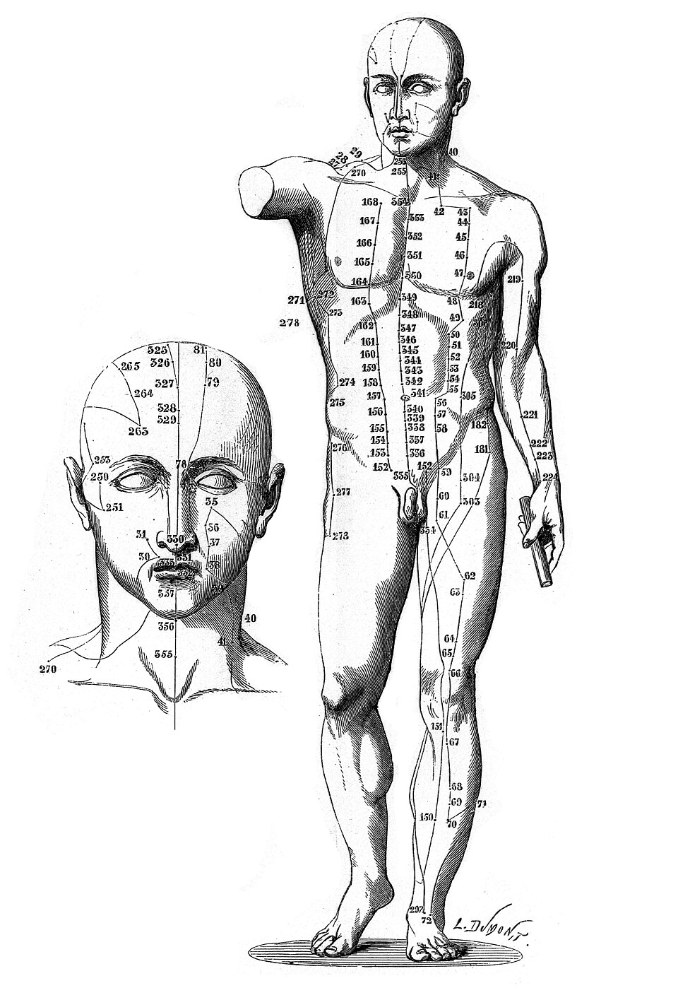
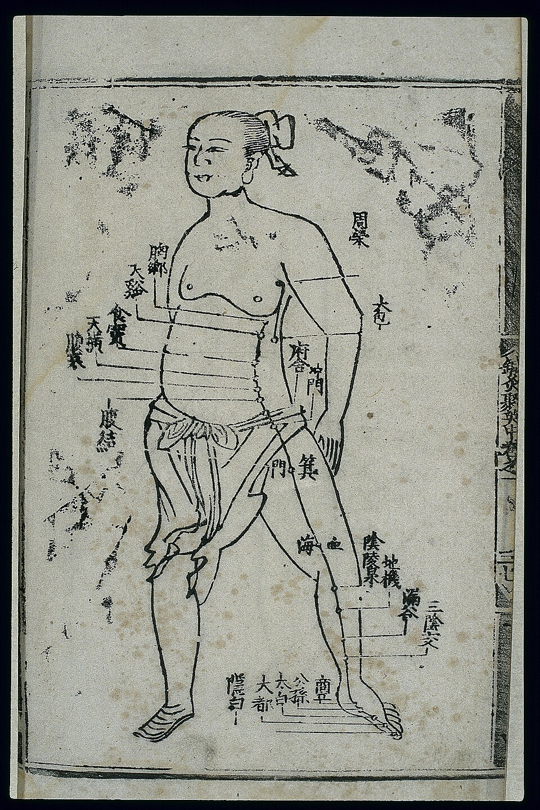
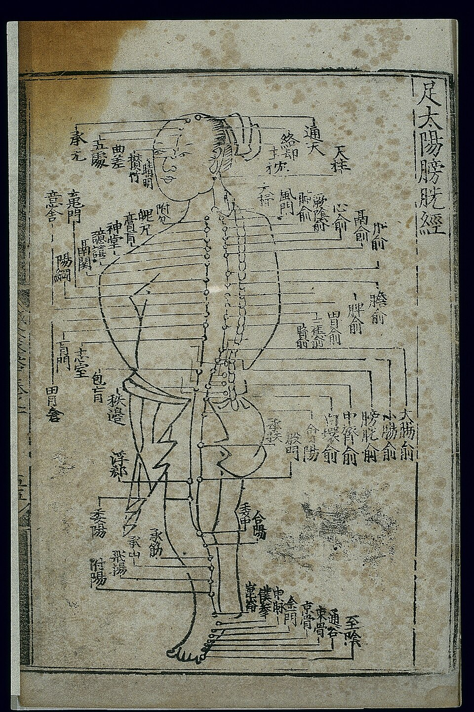

# 资料单 2：孕期推拿安全与禁忌 / Pregnancy Tuina Safety & Contraindications

**WIM 编码：** MP-031-3:2016-E02/KP(2/3)
**NOSS：** MP-031-3:2016 推拿疗法服务 (Level 3)
**CU：** E02 妇女推拿服务 (Woman Tuina Service)
**纸张颜色：** 白
**时数：** 32 小时
**最后更新：** 2026-04-17
---

## 学习成果

完成本资料单后，学员能够：
- 阐述妊娠期母体生理变化对推拿的影响
- **熟记并永久避免妊娠绝对禁忌五穴：合谷 LI4、三阴交 SP6、肩井 GB21、至阴 BL67、昆仑 BL60**
- 列出孕期相对禁忌部位与禁忌手法
- 掌握各孕期（1/2/3 trimester）的安全推拿原则
- 识别孕期推拿过程中的警讯反应并执行紧急停止流程
- 解释孕期推拿介质、体位与环境的安全要求

---

> ⚠️ **Pregnancy Contraindication** — LI-4 (合谷/Hegu), SP-6 (三阴交/Sanyinjiao), GB-21 (肩井/Jianjing) mentioned in this document are forbidden during pregnancy at all trimesters per T&CM Act 2013 Section 28. Do NOT apply to pregnant clients. See `_reference/pregnancy-safety-reference.md`.

## 一、妊娠期母体生理变化 / Maternal Physiological Changes

*图 2-1：整个妊娠期子宫高度（宫底）变化示意图——12 周后子宫超出耻骨联合，至 36 周可达剑突下。来源：Wikimedia Commons / OpenStax Anatomy & Physiology，CC BY 3.0*

| 系统 | 变化 | 推拿涉及 |
|------|------|----------|
| 心血管 | 血容量增加 30–50%；下肢静脉回流减慢 | 28 周后忌仰卧（防腔静脉压迫综合征） |
| 内分泌 | 松弛素 (relaxin) 增高，韧带松弛 | 关节按压力度减半，避免拉伸 |
| 骨骼 | 重心前移；耻骨联合分离 | 腰骶禁强按；耻骨区禁压 |
| 皮肤 | 妊娠纹、敏感性增高 | 介质必须低敏；禁热刺激 |
| 子宫 | 12 周后超出耻骨；腹部隆起 | 腹部完全禁推、禁按、禁摩 |

**重要警示：** 孕期任何强烈刺激（如重按、强刮、热灸下腹）都可能诱发宫缩、胎盘早剥、流产。

---

## 二、妊娠绝对禁忌五穴 / Five Absolute Forbidden Points

> **必须背诵**：以下五穴在整个妊娠期（从确诊到分娩）**严禁任何按压、艾灸、针刺**。考核必考。

| 序 | 穴位 | English | 部位 | 禁忌原因 |
|---|------|---------|------|----------|
| 1 | 合谷 | LI4 (Hegu) | 手背第 1、2 掌骨之间 | 强力下行作用，可催产、引产；古称"四总穴"之首 |
| 2 | 三阴交 | SP6 (Sanyinjiao) | 内踝尖上 3 寸，胫骨后缘 | 三阴交会，活血通经，强烈宫缩诱发 |
| 3 | 肩井 | GB21 (Jianjing) | 肩峰与大椎连线中点 | 气机下行作用极强，易致胎气下陷 |
| 4 | 至阴 | BL67 (Zhiyin) | 足小趾外侧爪甲角 | 古法用于矫正胎位 / 引产，孕期常规禁用 |
| 5 | 昆仑 | BL60 (Kunlun) | 外踝尖与跟腱之间凹陷 | 活血化瘀强；古书称"难产穴"，可催产 |

**记忆口诀：** "**合三肩至昆**，孕妇全不沾"

*图 2-2：人体针灸取穴标记图，可作为合谷 LI4、三阴交 SP6、肩井 GB21、至阴 BL67、昆仑 BL60 五穴位置的参照图。来源：Wikimedia Commons / Wellcome Collection，CC BY 4.0*

### 古籍依据

- 《针灸大成》：合谷、三阴交"孕妇泻之，立堕"
- 《医宗金鉴》：肩井"妊娠犯之，胎动不安"
- 《针灸甲乙经》：至阴"主胞衣不下"——反向警示孕中禁

---

### 古图参考：脾经路径

*图 2-3：足太阴脾经传统经络图——孕期严禁强刺激三阴交 SP6（内踝尖上 3 寸），以及整段腿内侧脾经路径。来源：Wikimedia Commons / Wellcome Collection，CC BY 4.0*

## 三、相对禁忌部位与穴位 / Relative Contraindications

| 部位 | 范围 | 限制 |
|------|------|------|
| **腹部** | 整个腹部（耻骨上至剑突下） | **完全禁止**任何手法 |
| **腰骶部** | L4–S5 棘突两侧、八髎 | 禁强按、禁深揉；可轻抚 |
| **腿内侧** | 三阴交至阴包整段足太阴脾经 | 禁强刺激；可表浅轻揉 |
| **下肢承山、委中** | 静脉回流路径 | 力度减半，避免长时间按压（防血栓脱落） |

*图 2-4：足太阳膀胱经传统经络图——孕期严禁刺激至阴 BL67（足小趾外侧）与昆仑 BL60（外踝跟腱间），且承山、委中等下肢穴位需减半力度。来源：Wikimedia Commons / Wellcome Collection，CC BY 4.0*

### 慎用穴位（非绝对禁，但需评估）

- 合谷之外的手阳明大肠经穴（曲池、手三里）— 力度宜轻
- 太冲 LR3 — 个体差异大，第 1 孕期慎用
- 命门 GV4、腰阳关 GV3 — 禁深按
- 子宫穴、气冲、冲门 — 全程严禁

---

## 四、各孕期推拿原则 / Trimester-Specific Guidelines

### 第一孕期 (0–12 周) — 最危险期

| 项目 | 要求 |
|------|------|
| 是否推拿 | **原则上避免**；如客户坚持，仅短时（≤15 分钟）轻柔肩颈 |
| 体位 | 坐位（前倾抱枕）或健侧卧 |
| 部位 | 仅头、颈、肩、上肢 |
| 力度 | 轻柔（VAS ≤ 3） |
| 禁忌 | 全部禁忌穴 + 全部慎用穴 |

### 第二孕期 (13–27 周) — 相对安全期

| 项目 | 要求 |
|------|------|
| 是否推拿 | 可以；本期为最佳调理期 |
| 体位 | **左侧卧**为主；可短时俯卧（用孕妇专用空腹床） |
| 部位 | 头、颈、肩、上肢、背部、腿外侧 |
| 力度 | 中轻（VAS ≤ 5） |
| 时长 | ≤ 30 分钟 |
| 禁忌 | 五大禁穴 + 腹部 + 腰骶 + 慎用穴 |

### 第三孕期 (28+ 周)

| 项目 | 要求 |
|------|------|
| 是否推拿 | 可以；以舒缓不适为主 |
| 体位 | **左侧卧**或半坐位；**严禁仰卧 > 5 分钟**（腔静脉压迫） |
| 部位 | 颈、肩、背上段、上肢 |
| 力度 | 轻柔 |
| 时长 | ≤ 20 分钟 |
| 注意 | 临产前 4 周更需谨慎；接近预产期可视情况停止 |

---

## 五、孕期禁忌手法 / Forbidden Techniques

| 手法 | 原因 |
|------|------|
| 强力按压 (深按) | 诱发宫缩 |
| 摩腹 | 直接刺激子宫 |
| 拍击腰骶 | 震动影响胎盘 |
| 强力扳法 | 韧带松弛易致脱位 |
| 强刺激手法（点穴、弹拨）于禁忌穴 | 流产、早产风险 |
| 艾灸下腹、腰骶 | 高温诱宫缩 |
| 拔罐于腹、腰骶 | 负压刺激 |

**适用手法：** 轻揉、轻按、轻摩（非腹部）、温和拿法（非肩井）、安抚式推法。

---

## 六、孕期推拿介质 / Pregnancy-Safe Media

| 类别 | 安全 | 禁用 |
|------|------|------|
| 基础油 | 婴儿油、葡萄籽油、甜杏仁油 | 蓖麻油、藏红花油 |
| 精油 | 极少量薰衣草、橙花（稀释 < 1%） | **严禁**：迷迭香、薄荷脑、肉桂、丁香、艾草、当归、红花、麝香相关任何配方 |
| 中药涂擦 | 温和草本（如生姜稀释）— 慎用 | 含活血、破血、堕胎药材任何配方 |
| 热源 | 温毛巾（< 40°C） | 艾灸、电加热垫直接腹/腰骶 |

> **禁忌中药列表（必背）**：红花、桃仁、三棱、莪术、麝香、藏红花、川芎过量、当归过量、芦荟、巴豆、牵牛子、附子、肉桂（非外用低剂量）。

---

## 七、警讯反应与紧急处理 / Warning Signs & Emergency Response

### 推拿过程中立即停止的征兆

| 征兆 | 处理 |
|------|------|
| 客户诉腹痛、宫缩感 | 立即停止；左侧卧休息；监测 30 分钟；不缓解送急诊 |
| 阴道出血 / 流液 | 立即停止；保持平卧；**立即拨 999 / 送医** |
| 胎动突然剧增/消失 | 立即停止；联系妇产科 |
| 头晕、视物模糊、呕吐 | 立即停止；半坐位；测血压；高血压送急诊（疑先兆子痫） |
| 下肢突然剧痛/肿胀 | 立即停止；不按摩；送医（疑深静脉血栓） |
| 客户晕厥 | 左侧卧；保持气道；拨 999 |

### 推拿后 24 小时内监测

教育客户回家后注意：腹痛、出血、胎动异常 → 立即就医并告知曾接受推拿。

---

## 八、文档与同意书 / Documentation

孕妇必须**额外签署"孕妇推拿专用同意书"**，包含：

1. 孕周确认（附产检卡复印件）
2. 主治医师同意（高危妊娠必须）
3. 客户已被告知禁忌五穴与流产风险
4. 客户对介质过敏史声明
5. 紧急联系人（含配偶/家属）
6. 紧急医院偏好

记录保存依 T&CM Act 2013 至少 6 年；产科相关记录至子女 21 岁（依 MOH 围产期照护标准）。

---

## 九、马来西亚法规与指南 / Legal & Guidelines

| 文件 | 关键内容 |
|------|----------|
| T&CM Act 2013 (Act 775) | 注册推拿师不得宣称可替代产前检查或助产 |
| MOH Perinatal Care Manual 3rd Ed | 围产期高危识别标准 |
| MOH T&CM Code of Ethics | 异性客户接触；同意书；保密 |
| Medicines (Advertisement & Sale) Act 1956 | **严禁**广告"安胎、助孕、催产" |

---

## 总结

妊娠期推拿是高风险服务。**禁忌五穴（合谷、三阴交、肩井、至阴、昆仑）必须永远避免**；腹部、腰骶强刺激必须避免；介质、体位、时长、力度均按孕期严格调整。任何警讯出现，必须立即停止并转诊。安全永远优先于效果。

---

## 参考文献

1. 《针灸大成》明·杨继洲
2. 《医宗金鉴·妇科心法要诀》清·吴谦
3. T&CM Act 2013 (Act 775)
4. MOH Malaysia: Perinatal Care Manual 3rd Edition
5. WHO Standard Acupuncture Point Locations (2009)
6. American Pregnancy Association: Prenatal Massage Guidelines
