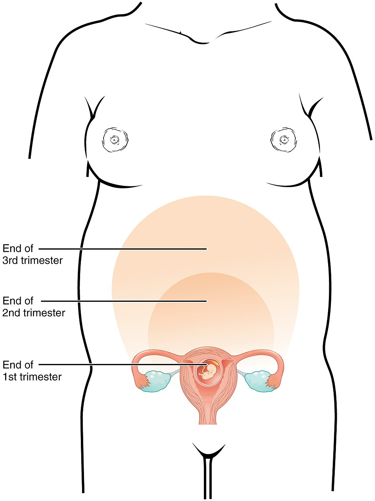

<!-- JPK_ENVELOPE_v1 -->
<table border="0" cellspacing="0" cellpadding="8" width="100%">
<tr>
<td width="130" valign="top"></td>
<td valign="middle">
<b>JABATAN PEMBANGUNAN KEMAHIRAN (JPK)</b> 
TINGKAT 7-8, BLOK D4, KOMPLEKS D, 
PUSAT PENTADBIRAN KERAJAAN PERSEKUTUAN, 
62530 PUTRAJAYA
</td>
</tr>
</table>

## KERTAS PENERANGAN

| Medan | Nilai |
| --- | --- |
| KOD DAN NAMA PROGRAM | MP-031-3:2016 PERKHIDMATAN TUINALOGI |
| TAHAP | 3 |
| KOD DAN TAJUK UNIT KOMPETENSI | MP-031-3:2016-E02 TUINALOGY SERVICES SUPERVISION |
| NO. DAN PERNYATAAN AKTIVITI KERJA | 1. MONITOR JUNIOR STAFF PERFORMANCE 2. CONDUCT ON-THE-JOB TRAINING 3. PROVIDE TECHNICAL GUIDANCE 4. EVALUATE STAFF COMPETENCY |
| NO. KOD | MP-031-3:2016-E02/KP(3/3) |
| Muka Surat | 1/1 |
| WARNA KERTAS | PUTIH (White) |

**TAJUK:** 资料单 3：产后、经期与更年期推拿 / Postpartum, Menstrual & Menopausal Tuina

**TUJUAN:** 完成本资料单后，学员能够：

<!-- /JPK_ENVELOPE_v1 -->
# 资料单 3：产后、经期与更年期推拿 / Postpartum, Menstrual & Menopausal Tuina

## 学习成果

完成本资料单后，学员能够：
- 阐述产褥期分阶段（早/中/后期）的推拿原则与禁忌
- 解释痛经（dysmenorrhea）与经前综合症 (PMS) 的中医病机与穴位选择
- 描述更年期综合症 (menopausal syndrome) 的中医辨证与调理思路
- 列出三种常见妇女不适（产后腰痛、痛经、更年期失眠）的标准穴位组合
- 解释产后催乳、退乳、回乳的不同原则
- 识别需立即转诊的产后、经期、更年期警讯

---

> ⚠️ **Pregnancy Contraindication** — LI-4 (合谷/Hegu), SP-6 (三阴交/Sanyinjiao), GB-21 (肩井/Jianjing) mentioned in this document are forbidden during pregnancy at all trimesters per T&CM Act 2013 Section 28. Do NOT apply to pregnant clients. See `_reference/pregnancy-safety-reference.md`.

## 一、产后推拿 / Postpartum Tuina

*图 E02-3-1：产褥期 6 周内子宫由足月体积逐步复旧至非孕状态，是产后腹部禁推时间窗的解剖学依据。来源：Wikimedia Commons / Public Domain*

### 1.1 产褥期分期 (Puerperium Stages)

| 阶段 | 时间 | 母体特点 | 推拿原则 |
|------|------|----------|----------|
| 早期 | 产后 0–14 天 | 恶露多；子宫复旧；伤口未愈；气血大虚 | 仅轻柔肩颈、上肢；禁腹/腰骶/下腹相关穴 |
| 中期 | 15–42 天（满月） | 恶露渐净；伤口愈合；体力渐复 | 加腰背、臀部调理；剖宫产仍禁疤痕区 |
| 后期 | 6 周后（产后检查正常） | 子宫复旧完成；性生活恢复 | 全面恢复；可进行子宫复旧推拿、塑形按摩 |

**剖宫产 (Caesarean Section) 特别注意：**
- 6 周内禁疤痕区 ± 5cm
- 6 周后可轻揉疤痕周围（疏通粘连）
- 12 周后可按疤痕评估行进一步康复

### 1.2 产后常见不适与调理

| 症状 | 病机 | 主穴 | 配穴 |
|------|------|------|------|
| 腰骶酸痛 | 气血两虚 + 肾虚 + 育儿弯腰 | 肾俞、命门（轻）、八髎（产后 2 周后） | 委中、承山 |
| 肩颈紧张 | 哺乳姿势、抱婴 | 肩中俞、肩外俞、天宗 | 风池（轻）、颈夹脊 |
| 乳汁不通 (galactostasis) | 肝郁气滞 / 气血不足 | 膻中、乳根、少泽（点按）、肩井（产后非孕可用，轻） | 太冲、足三里 |
| 产后便秘 | 气虚推动无力 | 天枢（产后 2 周后轻揉）、足三里、上巨虚 | 支沟 |
| 产后情志低落 (baby blues) | 肝郁、心脾两虚 | 神门、内关、太冲、安眠 | 百会、四神聪 |
| 耻骨联合不适 | 韧带松弛未复 | 周边轻按摩 + 物理治疗转介 | 不强按耻骨直接 |

### 1.3 催乳 / 退乳 / 回乳推拿

| 目的 | 适用 | 穴位 | 注意 |
|------|------|------|------|
| **催乳 (Promote)** | 乳汁分泌不足 | 膻中、乳根、少泽、足三里、关元（产后 6 周后） | 配合饮食与吸吮 |
| **通乳 (Unblock)** | 乳腺管堵塞、乳汁淤积 | 乳房周围放射状轻推、膻中、肩井 | 红肿热痛立即转诊（疑乳腺炎） |
| **退乳 (Reduce)** | 暂时减少 | 减少局部刺激；不按膻中、乳根 | — |
| **回乳 (Wean)** | 完全断奶 | 不做乳房推拿；可推太冲疏肝 | 通常配合中药麦芽 |

> **关键警示：** 乳房红、肿、热、痛、伴发热 → 疑**乳腺炎 (mastitis)**，**禁止用力按压**，立即转诊医师；可能需抗生素。

### 1.4 产后推拿禁忌

- 恶露未净 → 禁腹部任何手法
- 产后大出血史 → 暂停推拿，待医师评估
- 产褥感染（发热 ≥ 38°C） → 禁推拿
- 深静脉血栓 (DVT) 高危或已诊断 → 禁下肢按摩
- 剖宫产 6 周内疤痕区
- 严重贫血（Hb < 8 g/dL） → 慎推拿，需补血先行

---

## 二、经期推拿 / Menstrual Tuina

### 2.1 月经周期与中医分期

| 西医分期 | 时间 | 中医病机 |
|----------|------|----------|
| 月经期 | 第 1–5 天 | 血海下泄；气血暂亏 |
| 卵泡期 | 第 6–14 天 | 阴血渐复 |
| 排卵期 | 第 14 天 | 阴阳转化 |
| 黄体期 | 第 15–28 天 | 阳气渐长；肝郁易现 |

### 2.2 痛经 (Dysmenorrhea) 调理

#### 辨证分型

| 证型 | 特点 | 推拿原则 |
|------|------|----------|
| 气滞血瘀 | 经前胀痛、血块多、色暗 | 疏肝理气、活血（**仅非孕**） |
| 寒凝胞中 | 喜温拒按、得热则减、色暗块多 | 温经散寒；配合温敷 |
| 气血虚弱 | 经后隐痛、喜按、色淡量少 | 补气养血 |
| 肝肾亏虚 | 经后腰膝酸痛、量少 | 滋补肝肾 |

#### 痛经主穴组合

- **基础组**：关元（经期外可深按；经期轻揉）、气海、子宫穴、三阴交（**仅非孕妇**）
- **气滞瘀**：加太冲、合谷（**仅非孕**）、血海
- **寒凝**：加命门、肾俞 + 温敷
- **虚弱**：加足三里、脾俞、胃俞

> **经期推拿原则：** 经量过多者**减少腰骶强刺激**；可短时（15–20 分钟）轻柔放松；活血穴慎用。

### 2.3 经前综合症 (PMS) 调理

| 主症 | 穴位 |
|------|------|
| 胀乳 | 膻中、乳根、肩井（非孕）、太冲 |
| 头痛 | 百会、风池、太阳、合谷（非孕） |
| 烦躁 | 神门、内关、太冲 |
| 水肿 | 阴陵泉、三阴交（非孕）、水分（非孕） |

---

## 三、更年期推拿 / Menopausal Tuina

### 3.1 西医背景

- 围绝经期 (Perimenopause)：通常 45–55 岁，月经紊乱
- 绝经 (Menopause)：连续 12 个月无月经
- 主要症状：烘热 (hot flashes)、夜汗、失眠、情绪波动、骨密度下降、阴道干燥、性欲变化

### 3.2 中医辨证

| 证型 | 主症 | 治则 |
|------|------|------|
| 肾阴虚 | 烘热、盗汗、口干、腰膝酸 | 滋肾阴 |
| 肾阳虚 | 畏寒、面浮、便溏、性欲淡 | 温肾阳 |
| 肝郁化火 | 烦躁易怒、胸胁胀、失眠 | 疏肝清热 |
| 心肾不交 | 心悸失眠、健忘、五心烦热 | 交通心肾 |

### 3.3 主穴组合

| 目的 | 穴位 |
|------|------|
| 滋肾安神（基础） | 太溪、涌泉、神门、三阴交、关元 |
| 平肝清热 | 太冲、风池、百会 |
| 通心肾 | 心俞、肾俞、内关 |
| 缓解烘热 | 大椎、合谷、复溜 |
| 改善睡眠 | 安眠、四神聪、百会、神门 |
| 缓解骨关节痛 | 大杼、悬钟、阳陵泉、承山 |

### 3.4 更年期推拿注意

- 力度宜中等偏轻，避免出汗后受风
- 时间 45–60 分钟为宜
- 配合呼吸放松、轻音乐、温暖环境
- 注意潜在骨质疏松，避免强力按压脊柱

---

## 四、警讯与转诊 / Red Flags & Referral

### 产后转诊指征

- 持续高热 ≥ 38°C
- 恶露异常增多 / 恶臭 / 大块组织
- 乳房红肿热痛 + 发热（疑乳腺炎）
- 产后抑郁、自伤念头
- 剖宫产疤痕红肿热痛、化脓

### 经期转诊指征

- 突发剧痛伴晕厥（疑卵巢扭转、宫外孕）
- 月经持续 > 10 天
- 经量浸湿 ≥ 1 个卫生巾/小时持续 ≥ 2 小时
- 闭经 ≥ 3 个月（非孕）
- 经间期反复出血

### 更年期转诊指征

- 绝经后出血（**重要警讯**，需排除子宫内膜癌）
- 严重情绪障碍 / 自杀念头
- 严重失眠影响生活功能
- 骨折风险高（既往骨折史）

---

## 五、客户教育 / Client Education

### 产后客户

- 月子期间避风寒、忌生冷、忌过劳
- 凯格尔运动（盆底肌）
- 心理支持，识别产后抑郁
- 母乳喂养时姿势调整

### 经期客户

- 经期忌冷饮、忌剧烈运动、忌涉水
- 保暖腹部
- 记录经期周期与症状
- 痛经持续加重需妇科检查

### 更年期客户

- 钙 + 维生素 D 补充
- 适量负重运动（防骨质疏松）
- 心理调适；必要时心理咨询
- 定期妇科检查（含 Pap smear）

---

## 六、马来西亚妇女常见文化禁忌 / Cultural Considerations

| 文化群体 | 月子习俗 | 推拿配合 |
|----------|----------|----------|
| 马来族 | Berpantang 44 天，含药浴、热敷、Bertungku（热石熨腹） | 配合温暖环境，注意热敷温度 ≤ 45°C |
| 华族 | 30 天月子，姜醋、麻油鸡 | 配合温补思路 |
| 印度族 | Pulisai（产后按摩）传统 | 注意宗教/性别隔离 |
| 通用 | 部分客户避免某些日子（如生理期参拜禁忌） | 尊重并询问客户偏好 |

---

## 七、马来西亚法规 / Legal Reference

| 法规 | 涉及 |
|------|------|
| T&CM Act 2013 | 不得宣称"通乳神药""根治更年期" |
| Medicines (Advertisement & Sale) Act 1956 | 禁止虚假宣传 |
| PDPA 2010 | 妇女月经/孕产记录保密 |
| Employment Act 1955 (修订) | 产假 98 天；推拿师不得在客户产假期违规上门服务 |

---

## 总结

产后、经期、更年期是妇女推拿的三大主战场。学员须**严格按阶段判别禁忌**、**精准选穴**、**警惕红色警讯**。产后注意恶露与剖宫产疤痕；经期分清辨证选穴；更年期以滋肾安神为主。每一位妇女客户都应被尊重、被聆听、被保护。

---

## 参考文献

1. 罗元恺主编《中医妇科学》中国中医药出版社
2. 张吉《妇女保健推拿》人民卫生出版社
3. MOH Malaysia: Perinatal Care Manual 3rd Edition
4. NICE Guideline NG23: Menopause Diagnosis & Management
5. 国家中医药管理局《产后康复推拿技术规范》
6. T&CM Act 2013 (Act 775) & PDPA 2010